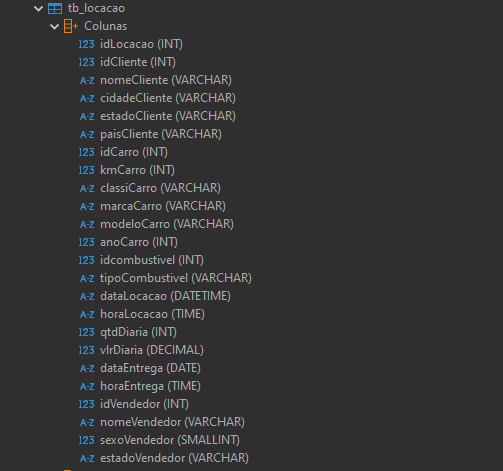
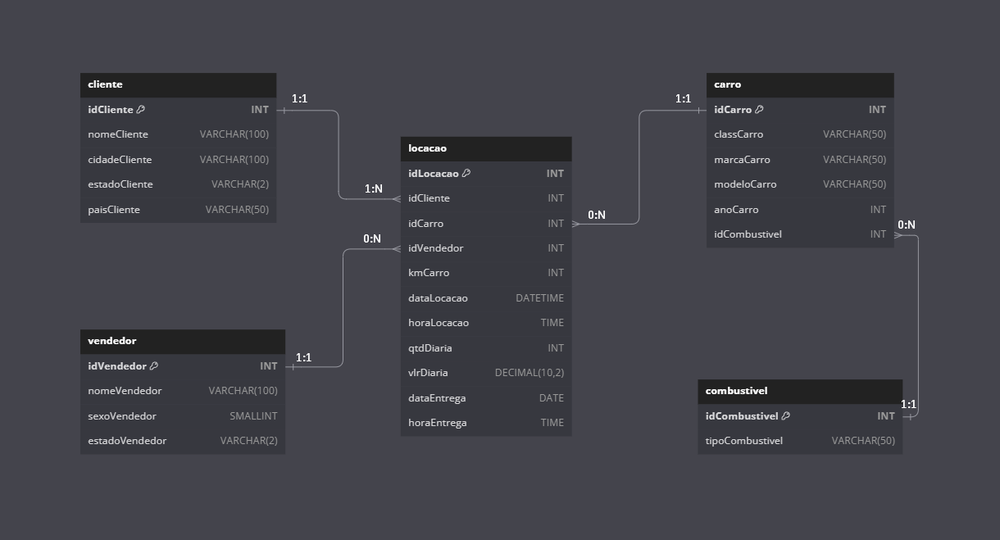
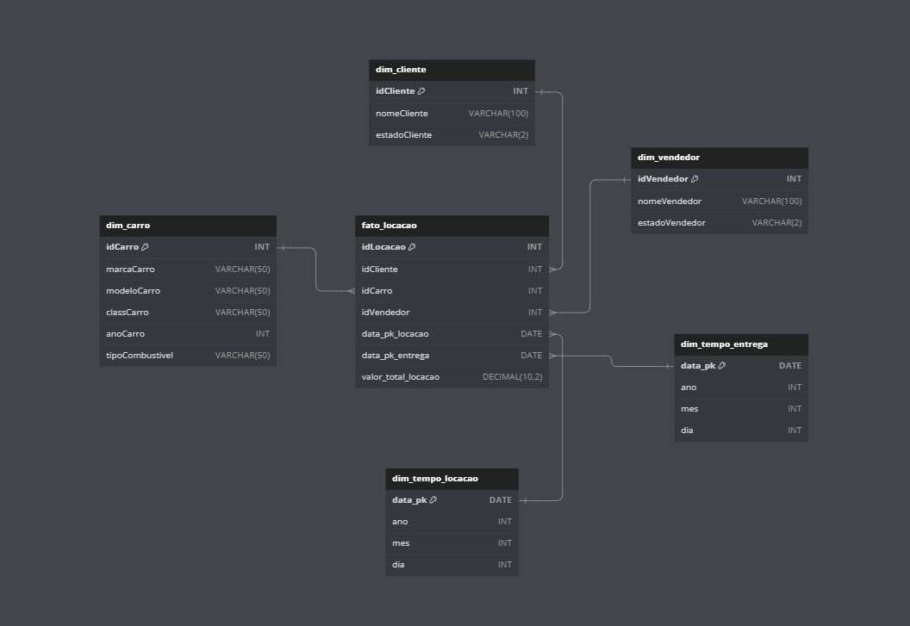

## 📂 **Estrutura de Arquivos**

A pasta `desafio` está organizada da seguinte forma:

```
desafio/
├── arquivo-final/ # Arquivo `concessionaria.sqlite` com a modelagem relacional e dimensional implementadas. 
├── diagramas/ # Pasta com diagramas dos modelos relacional e dimensional. 
├── etapa-1-modelagem-relacional/ # Pasta com script `.SQL` para execução da modelagem relacional. 
├── etapa-2-modelagem-dimensional/ # Pasta com script `.SQL` para execução da modelagem dimensional. 
├── concessionaria.zip/ # Arquivo inicial com a tabela `tb_locacao` desnormalizada. Use este arquivo para testar os scripts. 
└── README.md # Documentação detalhada do desafio.
```

---
## 🛠️: **Banco de Dados Desnormalizado**

### Estrutura do Banco Desnormalizado
 
O banco de dados original está no arquivo `concessionaria.zip` e apresenta a seguinte estrutura:



A tabela desnormalizada apresenta graves violações das **formas normais (FNs)**, incluindo redundâncias, dependências parciais e transitivas. Essas violações comprometem a integridade, escalabilidade e consistência do banco de dados.

---
## 🛠️ **Etapa 1: Modelagem Relacional**

### Descrição

A modelagem relacional foi realizada com base no banco desnormalizado. Aplicando as regras de normalização, foram criadas tabelas com relações 1:N e 1:1. O diagrama lógico é apresentado a seguir:



### Passo a Passo da Normalização

1. **Primeira Forma Normal (1ª FN)**  
   - Grupos de repetição e dados não atômicos foram separados em entidades como `Cliente`, `Carro`, `Vendedor`, `Combustivel` e `Locação`.  
   - **Exemplo**: Informações do cliente (`nomeCliente`, `cidadeCliente`, etc.) foram movidas para a tabela `Cliente`, eliminando duplicatas e garantindo dados atômicos.

2. **Segunda Forma Normal (2ª FN)**  
   - Dependências parciais foram removidas, separando atributos que dependiam apenas de partes da chave composta.  
   - **Exemplo**: Detalhes do carro (`modeloCarro`, `marcaCarro`, etc.) foram movidos para a tabela `Carro`, vinculando-a à tabela `Locação` por meio do `idCarro`.

3. **Terceira Forma Normal (3ª FN)**  
   - Dependências transitivas foram eliminadas, garantindo que todos os atributos dependam exclusivamente da chave primária.  
   - **Exemplo**: O atributo `estadoCliente` foi associado ao `idCliente` na tabela `Cliente`, evitando redundâncias e dependências transitivas.

---
### Código SQL

O script a seguir cria as tabelas normalizadas:

```sql
CREATE TABLE cliente (
    idCliente INT PRIMARY KEY,
    nomeCliente VARCHAR(100),
    cidadeCliente VARCHAR(100),
    estadoCliente VARCHAR(2),
    paisCliente VARCHAR(50)
);

CREATE TABLE carro (
    idCarro INT PRIMARY KEY,
    classCarro VARCHAR(50),
    marcaCarro VARCHAR(50),
    modeloCarro VARCHAR(50),
    anoCarro INT,
    idCombustivel INT
);
```

Script completo pode ser encontrado no arquivo [Script do Modelo Relacional](etapa-1-modelagem-relacional/modelagem-relacional.sql).

### Validação

A consulta abaixo valida o modelo relacional, unindo as tabelas para verificar a consistência dos dados:

```sql
SELECT
    l.idLocacao,
    c.nomeCliente,
    car.modeloCarro,
    v.nomeVendedor,
    l.dataLocacao,
    l.dataEntrega
FROM locacao l
JOIN cliente c ON l.idCliente = c.idCliente
JOIN carro car ON l.idCarro = car.idCarro
JOIN vendedor v ON l.idVendedor = v.idVendedor
LIMIT 10;
```

Resultado da consulta:


---
### **Inserção de Dados nas Tabelas Normalizadas**

Para popular as tabelas normalizadas, os dados foram extraídos da tabela desnormalizada `tb_locacao`, utilizando `SELECT DISTINCT` para garantir a exclusividade dos registros. Além disso, ajustes foram realizados nos campos de data para assegurar o formato ISO (`YYYY-MM-DD`), corrigindo inconsistências na tabela original.

**Correção de Formato de Datas**  
   As colunas `dataLocacao` e `dataEntrega` foram atualizadas para garantir o formato padrão ISO, eliminando caracteres indesejados.  
   ```sql
   UPDATE tb_locacao
   SET dataLocacao = SUBSTR(REPLACE(REPLACE(dataLocacao, '.', ''), '/', ''), 1, 4)
       || '-' || SUBSTR(REPLACE(REPLACE(dataLocacao, '.', ''), '/', ''), 5, 2)
       || '-' || SUBSTR(REPLACE(REPLACE(dataLocacao, '.', ''), '/', ''), 7, 2);

   UPDATE tb_locacao
   SET dataEntrega = SUBSTR(REPLACE(REPLACE(dataEntrega, '.', ''), '/', ''), 1, 4)
       || '-' || SUBSTR(REPLACE(REPLACE(dataEntrega, '.', ''), '/', ''), 5, 2)
       || '-' || SUBSTR(REPLACE(REPLACE(dataEntrega, '.', ''), '/', ''), 7, 2);
```

---
## 🛠️ **Etapa 2: Modelagem Dimensional**

### Descrição

O modelo dimensional foi criado com base na estrutura relacional, organizando os dados em uma tabela fato e dimensões. O diagrama lógico é apresentado abaixo:



### Estrutura

#### Tabela Fato
A tabela fato `fato_locacao` contém os seguintes campos:
```sql
CREATE VIEW fato_locacao AS
SELECT
idLocacao,
idCliente,
idCarro,
idVendedor,
qtdDiaria * vlrDiaria as valor_total_locacao,
date(dataLocacao) as data_locacao
FROM locacao;
```

#### Dimensões
Exemplo de uma dimensão:

```sql
CREATE TABLE dim_cliente (
    idCliente INT PRIMARY KEY,
    nomeCliente VARCHAR(100),
    estadoCliente VARCHAR(2)
);
```

Os dados foram previamente extraídos e normalizados nas tabelas do modelo relacional usando `DISTINCT` para eliminar redundâncias. As `views` dimensionais, como a `dim_cliente`, organizam os dados já consolidados, garantindo consistência e integridade, exemplo de consulta simples na dim_cliente:


Script completo pode ser encontrado no arquivo [Script do Modelo Dimensional](etapa-2-modelagem-dimensional/modelagem-dimensional.sql)

---
### Validação

Consulta para validação do modelo dimensional:

```sql
SELECT
    l.idLocacao,
    d.ano,
    c.nomeCliente,
    car.modeloCarro,
    v.nomeVendedor
FROM fato_locacao l
JOIN dim_tempo_locacao d ON l.data_pk_locacao = d.data_pk
JOIN dim_cliente c ON l.idCliente = c.idCliente
JOIN dim_carro car ON l.idCarro = car.idCarro
JOIN dim_vendedor v ON l.idVendedor = v.idVendedor
LIMIT 10;
```

Resultado da consulta:


---

## 🚀 Como Reproduzir

1. Abra o concessionaria.zip em algum SGBD, utilizei o DBeaver.
2. Execute o script `modelagem-relacional.sql` para criar o modelo relacional.
3. Execute o script `modelagem-dimensional.sql` para criar o modelo dimensional.
4. Utilize as consultas de validação para verificar a consistência dos dados.

---

