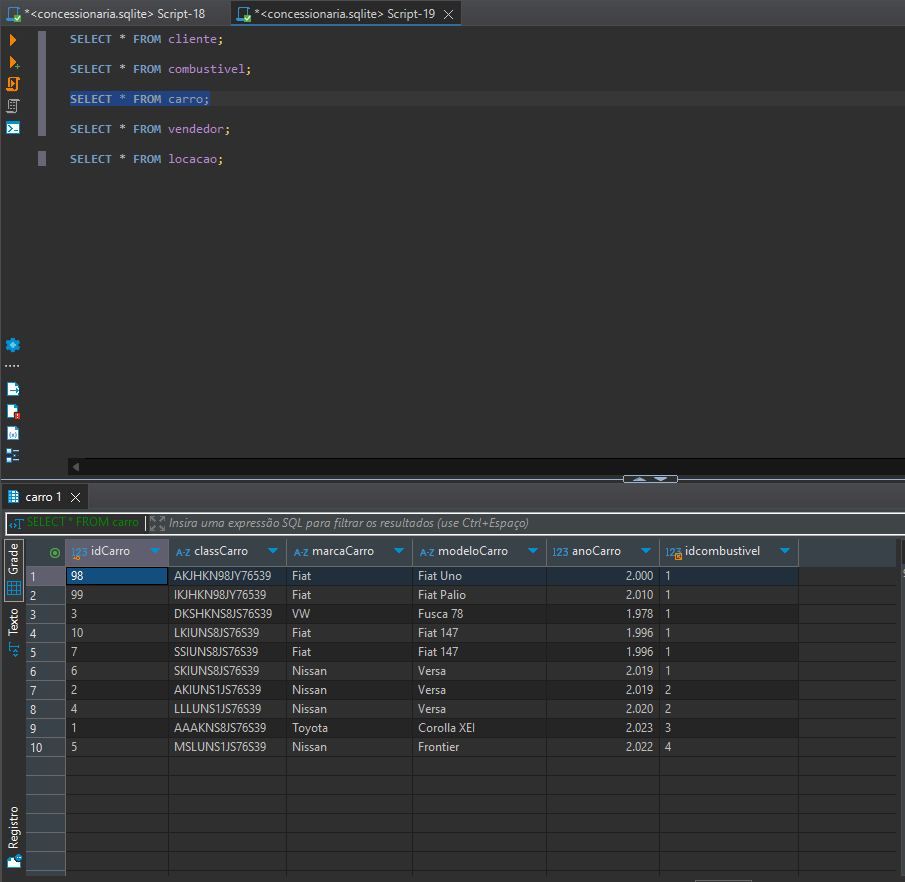

## Estrutura de Pastas
A pasta **Sprint 1** está organizada da seguinte forma:

```
├── Certificados/ # Certificados conquistados na trilha de Data & Analytics. Nenhum certificado foi obtido especificamente nesta Sprint. 

├── Desafio/ # Implementações relacionadas ao desafio. 
├── Evidencias/ # Imagens que comprovam a execução do desafio. 
├── Exercicios/ # Scripts e resoluções dos exercícios dos casos de estudo: Biblioteca e Loja. 
└── README.md # Documentação da Sprint 1.
```

---

## Certificados

Certificados obtidos durante a Sprint 1 estão disponíveis na pasta [Certificados](Certificados/). 
Nenhum certificado foi obtido especificamente nesta Sprint.

---
### Desafio

A pasta **[Desafio](Desafio/)** contém todos os artefatos relacionados ao desafio da Sprint. Ela está organizada para facilitar o entendimento das entregas e inclui os seguintes itens:

- **README.md**: Documentação detalhada sobre o desafio, explicando as etapas e os resultados.
- **diagramas/**: Representações visuais dos modelos utilizados.
- **etapa-1-modelagem-relacional/**: Script referente à modelagem relacional.
- **etapa-2-modelagem-dimensional/**: Script referente à modelagem dimensional.
- **arquivo-final/: Banco de dados SQLite com as implementações das modelagens relacional e dimensional.
- **concessionaria.zip**: Arquivo compactado contendo o banco de dados original, utilize esse para seguir o passo a passo da modelagem relacional e dimensional

---
## Evidências

As evidências para a validação dos exercícios e modelos estão organizadas na pasta.

Exemplo de consulta realizada em uma das tabelas do modelo relacional, disponível na pasta [Evidencias](Evidencias/):



---
## Exercícios

Os exercícios desta pasta foram resolvidos como parte da trilha de aprendizado em **Data & Analytics**, especificamente nas seções relacionadas a SQL. Cada exercício foi projetado para consolidar habilidades práticas em consultas e análise de dados. Organizei o conteúdo de forma progressiva, seguindo a sequência da trilha.

### Seção 3: Biblioteca
Foco na criação e manipulação de consultas relacionadas a um sistema de biblioteca.

**Exemplo de Código:**
[Arquivo: secao-3-biblioteca/ex1.sql](secao-3-biblioteca/ex1.sql)

```sql
-- E01: Apresente a query para listar todos os livros publicados após 2014.
SELECT *
FROM livro
WHERE publicacao > '2014-12-31'
ORDER BY cod;
```

### Seção 4: Loja
Os exercícios desta seção têm como foco o gerenciamento de vendas em uma loja.

A consulta foi elaborada para identificar o vendedor com maior número de vendas concluídas. Essa análise é relevante para entender a performance individual dos vendedores e auxiliar na tomada de decisão.

**Exemplo de Código:**
[Arquivo: secao-4-loja/ex8.sql](secao-4-loja/ex8.sql)

```sql
-- E08: Apresente a query para listar o código e o nome do vendedor com maior
-- número de vendas (contagem), e que estas vendas estejam com o status concluída.
SELECT 
    TBVENDEDOR.cdvend, 
    TBVENDEDOR.nmvdd
FROM TBVENDEDOR
INNER JOIN TBVENDAS ON TBVENDEDOR.cdvend = TBVENDAS.cdven
WHERE TBVENDAS.status = 'Concluido'
GROUP BY TBVENDEDOR.cdvend, TBVENDEDOR.nmvdd
ORDER BY COUNT(TBVENDAS.cdven) DESC
LIMIT 1;
```

---
