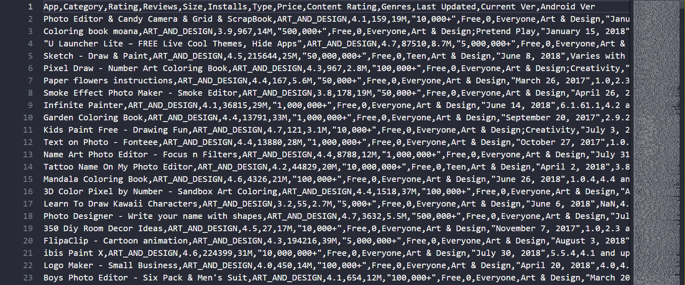
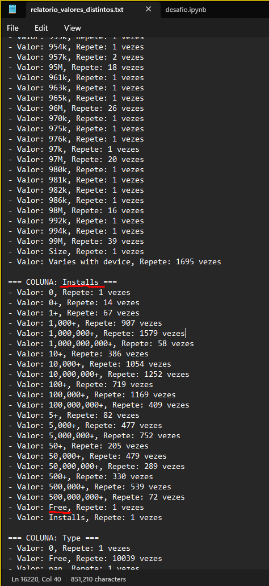
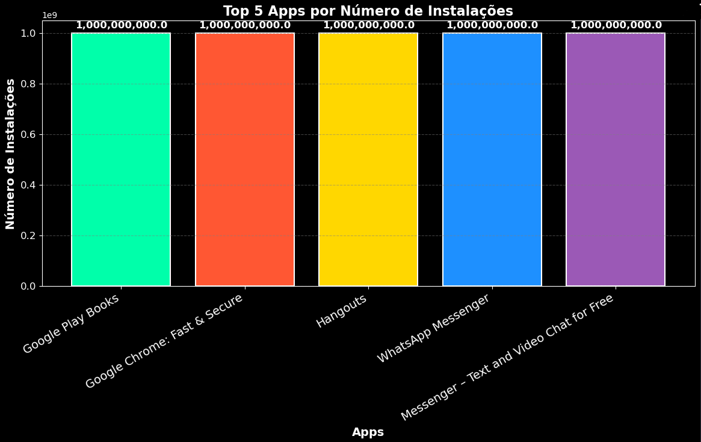
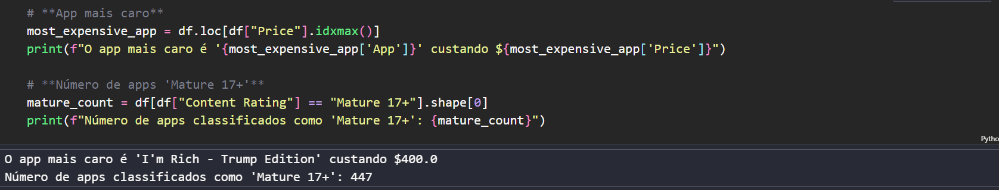
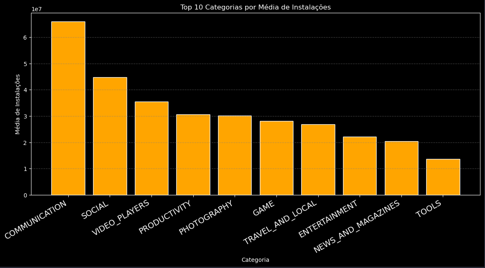
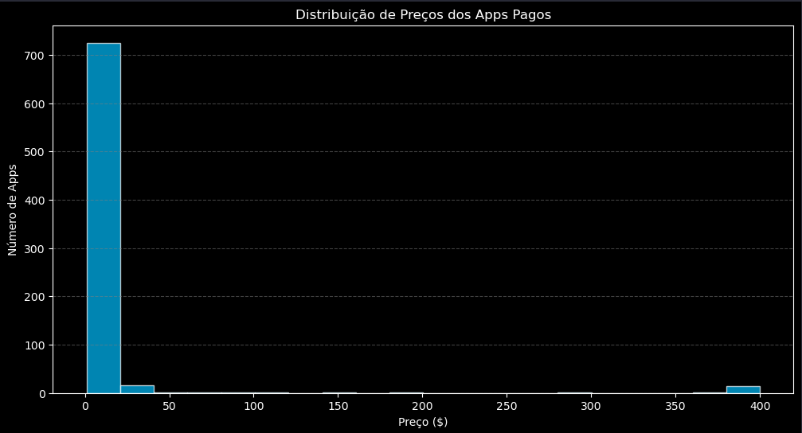
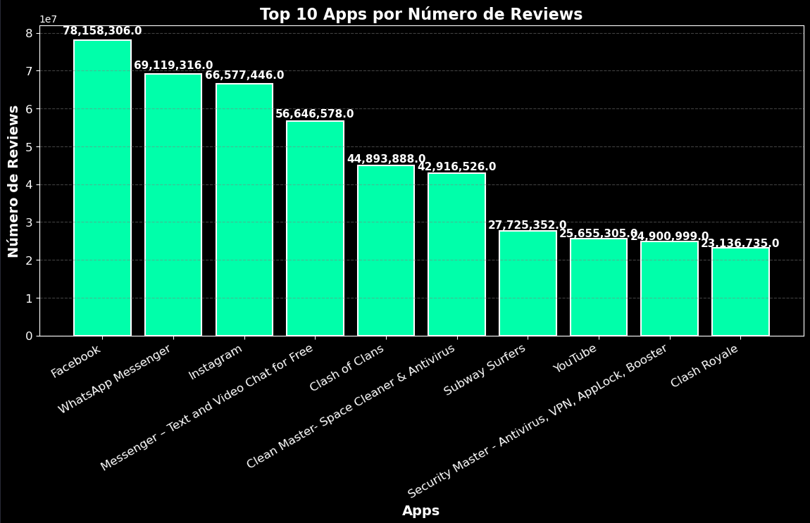

# Estrutura da Pasta Desafio

A pasta [`Desafio/`](Desafio/) está organizada da seguinte forma:

- [`notebook_jupyter/`](notebook_jupyter/) - Notebook Jupyter com o código de análise
- [`googleplaystore.csv`](googleplaystore.csv) - Dataset original utilizado na análise
- [`relatorio_valores_distintos.txt`](relatorio_valores_distintos.txt) - Relatório gerado com estatísticas detalhadas dos valores distintos das colunas
- [`README.md`](README.md) - Documentação do desafio

---
## Conjunto de Dados

O dataset utilizado é o [`googleplaystore.csv`](googleplaystore.csv), contendo informações sobre aplicativos disponíveis na Google Play Store. Esse conjunto de dados inclui atributos como nome do app, categoria, número de downloads, avaliações, tipo de monetização e classificação indicativa.

Quando visualizamos o arquivo .csv inicialmente, podemos identificar essa estrutura:


---
## Etapas da Análise

### 1) Diagnóstico Inicial

Foram verificadas as colunas do dataset, identificando a necessidade de limpeza e transformação dos dados. A função `diagnostico_completo()` foi utilizada para listar e organizar as informações de cada coluna. O relatório gerado está disponível em [`relatorio_valores_distintos.txt`](relatorio_valores_distintos.txt), contendo:

- Lista dos valores distintos de cada coluna, organizados em ordem alfabética (A-Z)
- Contagem da frequência de cada valor
- Inclusão de valores nulos e sua respectiva quantidade
- Identificação de possíveis inconsistências nos dados, como caracteres especiais ou variações inesperadas

Por exemplo, a ordenação dos valores revelou um erro na coluna **Installs**. O valor Free foi detectado dentro dessa coluna, o que indica um possível erro de tipagem ou registro incorreto.

Coluna: Installs

Valor: Free, Repetições: 1

Esse valor não deveria estar presente nessa coluna, pois a coluna Installs deveria conter apenas números representando a quantidade de instalações.

A ordenação dos valores em ordem alfabética (A-Z) permite detectar rapidamente valores que fogem da lógica esperada.


### 2) Limpeza dos Dados

Foram aplicadas as seguintes transformações:
- Remoção de linhas duplicadas.
- Conversão da coluna `Installs` para valores numéricos, removendo caracteres não numéricos.
- Conversão da coluna `Price`, retirando o símbolo `$` e transformando para tipo numérico.
- Conversão da coluna `Reviews` para tipo numérico, garantindo a coerência das análises.

### 3) Geração de Gráficos

Código fonte que gera o top 5 instalações:
```python
# **Top 5 Apps por Número de Instalações**
top_5_installs = df.nlargest(5, "Installs")
plt.figure(figsize=(14, 7))  # Aumentando levemente o tamanho da figura
plt.bar(top_5_installs["App"], top_5_installs["Installs"], color=['blue', 'orange', 'green', 'red', 'purple'])

# Ajustando os rótulos para melhor exibição mesmo em janelas menores
plt.xlabel("Apps")
plt.ylabel("Número de Instalações")
plt.title("Top 5 Apps por Número de Instalações")

# Rotação de 30° para melhor ajuste e aumento da fonte
plt.xticks(rotation=30, ha='right', fontsize=14)

# Adicionando um padding extra no bottom para evitar corte dos nomes em janelas menores
plt.subplots_adjust(bottom=0.25)

# Adicionando grid discreto para facilitar a leitura
plt.grid(axis='y', linestyle='--', alpha=0.7)

# Exibindo o gráfico atualizado
plt.show()
```

Gráficos foram gerados para visualizar padrões nos dados. Os principais incluem:

#### **Top 5 Apps por Número de Instalações**
Destacando os aplicativos mais populares com base no número de downloads.



#### **Distribuição de Preços**
Demonstrando como os aplicativos pagos estão distribuídos em relação ao preço.



#### **Cálculos Adicionais**
Gráficos que mostram cálculos adicionais para validar padrões nos dados.




#### **Distribuição de Categorias**
Exibindo a frequência de cada categoria dentro do dataset.


#### **Avaliações e Review Score**
Análise dos top 10 aplicativos com melhores avaliações e pontuação.



### 4) Notebook Jupyter

A pasta [`notebook_jupyter/`](notebook_jupyter/) contém o código utilizado para processamento, análise e geração dos gráficos. Ele pode ser executado no Jupyter Notebook para reproduzir os resultados e realizar novas análises.

---
## Como Executar

1. Abra o notebook disponível em [`notebook_jupyter/`](notebook_jupyter/).
2. Execute as células do notebook para carregar e processar os dados.
3. Visualize os gráficos gerados dentro do notebook.
4. Consulte o relatório de valores distintos em [`relatorio_valores_distintos.txt`](relatorio_valores_distintos.txt).

