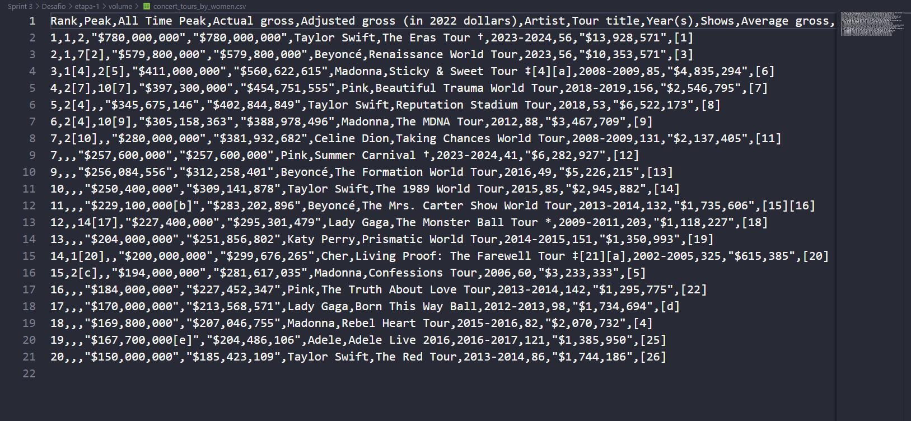
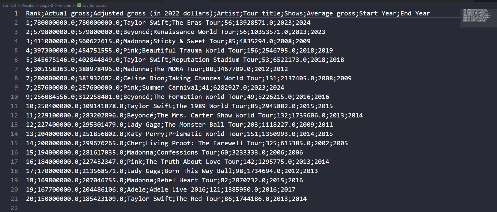

# Desafio Sprint 3: Processamento de Dados com Docker

O objetivo deste desafio é realizar o processamento e análise de dados utilizando contêineres Docker. 
O projeto é dividido em duas etapas principais, com a utilização de volumes para compartilhamento de dados entre os contêineres.

---

## Estrutura da Pasta Desafio

```plaintext
├── Desafio/
│   ├── etapa-1/
│   │   ├── volume/
│   │   │   └── concert_tours_by_women.csv
│   │   ├── Dockerfile
│   │   └── etl.py
│   ├── etapa-2/
│   │   ├── volume/
│   │   │   ├── csv_limpo.csv
│   │   │   ├── respostas.txt
│   │   │   ├── graficos/
│   │   │   │   ├── Q4.png
│   │   │   │   └── Q5.png
│   │   ├── Dockerfile
│   │   └── job.py
│   └── docker-compose.yml
```

---

## Etapas do Desafio

### **Etapa 1: Extração e Limpeza de Dados**
- **Objetivo:** 
  Ler o arquivo [`concert_tours_by_women.csv`](etapa-1/volume/concert_tours_by_women.csv) e realizar a limpeza dos dados, salvando o resultado em um novo arquivo [`csv_limpo.csv`](etapa-2/volume/csv_limpo.csv).
  


- **Implementação:**
  - Utilização de um script Python ([`etl.py`](etapa-1/etl.py)) que:
    - Lê o CSV de entrada.
    - Aplica transformações nas colunas, como remoção de caracteres indesejados e ajuste de formatos.
    - Salva os dados limpos no volume compartilhado `/volume_output`.

- **Detalhes Técnicos:**
  - Imagem base: `python:3.12-slim`.
  - O volume de entrada está localizado em `./etapa-1/volume`.
  - O arquivo limpo é salvo em `./etapa-2/volume`.

- **Execução do Contêiner:**
  ```bash
  docker run -v ${PWD}/etapa-1/volume:/volume_input -v ${PWD}/etapa-2/volume:/volume_output etl_image
  ```

**Execução da etapa 1:**


---

### **Etapa 2: Análise de Dados e Geração de Gráficos**
- **Objetivo:** 
  Processar o arquivo [`csv_limpo.csv`](etapa-2/volume/csv_limpo.csv) gerado na Etapa 1, realizar análises e gerar gráficos com base nos dados.



- **Implementação:**
  - Utilização de um script Python ([`job.py`](etapa-2/job.py)) que:
    - Lê o arquivo [`csv_limpo.csv`](etapa-2/volume/csv_limpo.csv).
    - Realiza cálculos e salva as respostas em [`respostas.txt`](etapa-2/volume/respostas.txt).
    - Gera gráficos ([`Q4.png`](etapa-2/volume/graficos/Q4.png) e [`Q5.png`](etapa-2/volume/graficos/Q5.png)) no diretório `graficos`.

- **Detalhes Técnicos:**
  - Imagem base: `python:3.12-slim`.
  - Bibliotecas utilizadas: `pandas` e `matplotlib`.
  - O volume de entrada/saída está localizado em `./etapa-2/volume`.

- **Execução do Contêiner:**
  ```bash
  docker run -v ${PWD}/etapa-2/volume:/volume etapa_2_image
  ```

- **Gráficos Gerados:**
  - Faturamento por Ano - Taylor Swift  
    
  - Top 5 Artistas com Mais Shows  
    


**Execução da etapa 2:**


---

## Integração com Docker Compose

Para conectar as duas etapas e executar o desafio de forma automatizada, utilizamos o arquivo [`docker-compose.yml`](docker-compose.yml). Ele define os dois serviços (etapa-1 e etapa-2) e mapeia os volumes necessários.

### **Configuração do `docker-compose.yml`**
- O volume compartilhado é definido como `/volume`.
- A execução é orquestrada de forma sequencial, garantindo que o arquivo gerado pela Etapa 1 esteja disponível para a Etapa 2.

### **Comandos**
- Para construir e executar os contêineres:
  ```bash
  docker-compose up --build
  ```
- Para encerrar os contêineres:
  ```bash
  docker-compose down
  ```

**Execução do docker compose:**


---

## Observações
- Certifique-se de estar logado no Docker Hub antes de iniciar:  
  ```bash
  docker login
  ```
- Todo o desafio foi estruturado para ser executado exclusivamente via [`docker-compose.yml`](docker-compose.yml).
