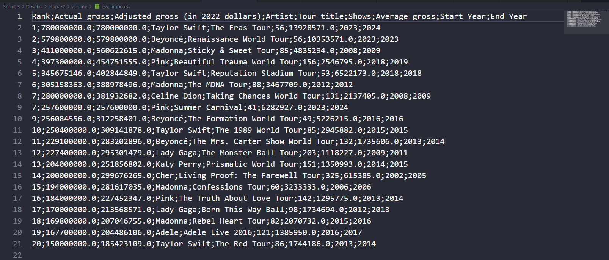

## Estrutura de Pastas
A pasta **Sprint 3** está organizada da seguinte forma:

```
Sprint 3/
├─ Certificados/  # Certificados conquistados durante a sprint
├─ Desafio/       # Implementações e análises relacionadas ao desafio da sprint
├─ Evidencias/    # Imagens que comprovam a execução das atividades do desafio
├─ Exercicios/    # Scripts e resoluções dos exercícios práticos de Docker
└─ README.md      # Documentação da Sprint 3
```

---

## Certificados

Os certificados obtidos durante a Sprint 2 estão disponíveis na pasta [Certificados](Certificados/). Obtivemos certificados da AWS nesta sprint (AWS Partner: Technical Accredited).

---

### Desafio:

A pasta **[Desafio](Desafio/)** contém todos os artefatos relacionados ao desafio desta sprint. A estrutura está organizada para facilitar o entendimento das entregas e inclui os seguintes itens:

- **[README.md](Desafio/README.md)**: Documentação detalhada com a descrição das etapas do desafio, resultados esperados e evidências geradas.
- **[etapa-1/](Desafio/etapa-1/)**: Contém os arquivos referentes à Etapa 1 (Extração e Limpeza de Dados), incluindo:
  - **[Dockerfile](Desafio/etapa-1/Dockerfile)**: Configuração do ambiente para a execução do script.
  - **[etl.py](Desafio/etapa-1/etl.py)**: Script Python responsável pelo processamento inicial dos dados.
  - **[volume/](Desafio/etapa-1/volume/)**: Pasta com o arquivo bruto de entrada:
    - **[concert_tours_by_women.csv](Desafio/etapa-1/volume/concert_tours_by_women.csv)**.

- **[etapa-2/](Desafio/etapa-2/)**: Contém os arquivos referentes à Etapa 2 (Análise e Geração de Gráficos), incluindo:
  - **[Dockerfile](Desafio/etapa-2/Dockerfile)**: Configuração do ambiente para a execução do script.
  - **[job.py](Desafio/etapa-2/job.py)**: Script Python responsável pela análise e geração de gráficos.
  - **[volume/](Desafio/etapa-2/volume/)**: Pasta de entrada e saída para a Etapa 2, contendo:
    - **[csv_limpo.csv](Desafio/etapa-2/volume/csv_limpo.csv)**: Arquivo processado na Etapa 1.
    - **[respostas.txt](Desafio/etapa-2/volume/respostas.txt)**: Respostas geradas pela análise de dados.
    - **[graficos/](Desafio/etapa-2/volume/graficos/)**: Gráficos gerados, incluindo:
      - **[Q4.png](Desafio/etapa-2/volume/graficos/Q4.png)**
      - **[Q5.png](Desafio/etapa-2/volume/graficos/Q5.png)**

- **[docker-compose.yml](Desafio/docker-compose.yml)**: Arquivo para orquestração dos contêineres Docker.

---

## Evidências:

As evidências para validação das análises e execuções realizadas estão armazenadas na pasta [Evidencias](Evidencias/). Esta pasta contém capturas de tela e outros registros que comprovam a execução do desafio.

Exemplo de evidência gerada:



---

## Exercícios

Os exercícios foram organizados seguindo a estrutura do PB da Sprint 3

### Etapa 1: carguru.py
Consiste em criar e executar um container Docker que roda um script Python simples, chamado carguru.py

**Exemplo de Código:**
[carguru.py](Exercicios/etapa-1/carguru.py)
```python
import random

carros = ['Chevrolet Agile','Chevrolet C-10','Chevrolet Camaro','Chevrolet Caravan','Chevrolet Celta','Chevrolet Chevette','Chevrolet Corsa','Chevrolet Covalt','Chevrolet D-20','Chevrolet Monza','Chevrolet Onix','Chevrolet Opala','Chevrolet Veraneio','Citroën C3','Fiat 147','Fiat Argo','Fiat Cronos','Fiat Mobi','Fiat Panorama','Ford Corcel','Ford Escort','Ford F-1000','Ford Ka','Ford Maverick','Honda City','Honda Fit','Hyundai Azera','Hyundai HB20','Hyundai IX-35','Hyundai Veloster','Peugeot 2008','Peugeot 206','Peugeot 208','Peugeot 3008','Peugeot 306','Peugeot 308','Renault Kwid','Renault Logan','Renault Sandero','Renault Twingo','Renault Zoe','Toyota Etios','Toyota Yaris ','Volkswagen Apolo','Volkswagen Bora','Volkswagen Brasilia   ','Volkswagen Fusca','Volkswagen Gol','Volkswagen Kombi','Volkswagen Parati','Volkswagen Passat','Volkswagen Polo','Volkswagen SP2','Volkswagen Santana','Volkswagen Voyage','Volkswagen up!']

random_carros = random.choice(carros)

print('Você deve dirigir um '+ random_carros)
```

### Etapa 2: mascarar-dados
Consiste na criação de um container Docker que executa um script Python para mascarar dados

**Exemplo de Código:**
[main.py](Exercicios/etapa-2/main.py)
```python
import hashlib  # Importa o módulo hashlib para trabalhar com algoritmos de hash

# Loop infinito para manter o programa em execução até o usuário decidir sair
while True:
    # Solicita ao usuário que digite uma string ou "sair" para encerrar
    entrada = input('Digite uma string (ou "sair" para encerrar): ').strip()
    
    # Verifica se o usuário digitou "sair" (ignora maiúsculas e minúsculas)
    if entrada.lower() == 'sair':
        print('Encerrando o programa.')  # Mensagem de encerramento
        break  # Sai do loop e finaliza o programa
    
    # Verifica se a entrada está vazia
    if not entrada:
        print('Entrada inválida. Por favor, digite algo.')  # Informa que a entrada foi inválida
        continue  # Volta ao início do loop para pedir uma nova entrada
    
    # Calcula o hash SHA-1 da string digitada
    hash_sha1 = hashlib.sha1(entrada.encode()).hexdigest()
    
    # Exibe o hash gerado
    print(f'Hash SHA-1: {hash_sha1}')
```

