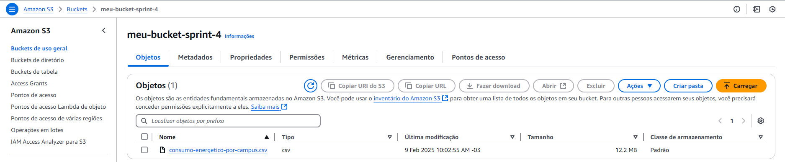
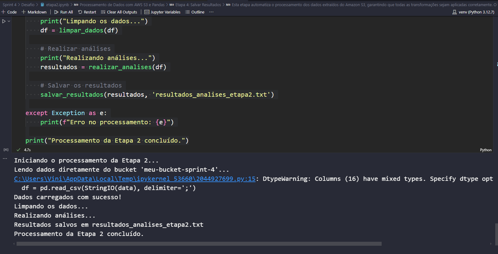
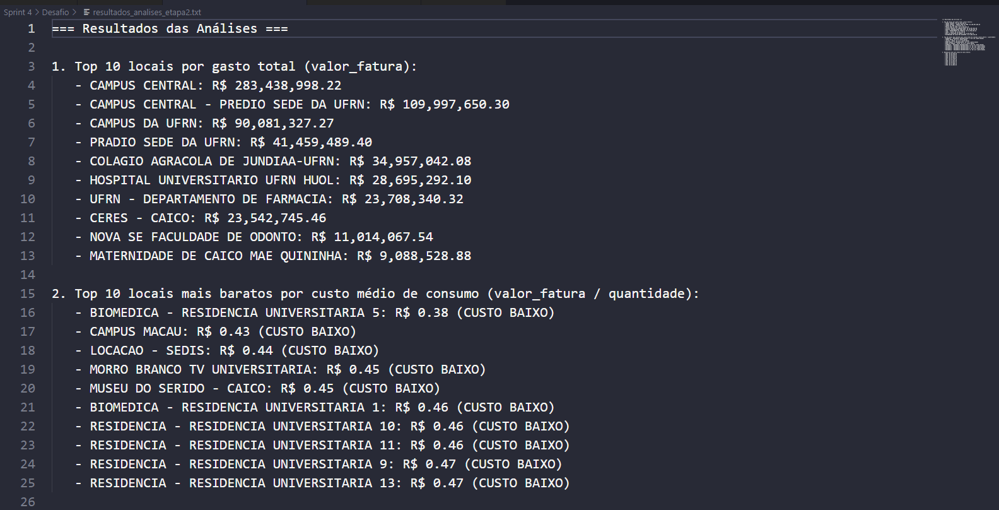

# Guia de Execução - Desafio Sprint 4

Este documento contém todas as instruções para configurar o ambiente, executar as etapas do desafio e entender o processamento dos dados.

---

##  1. Configuração do Ambiente

Para executar corretamente as etapas, é necessário configurar um ambiente virtual e instalar as dependências.

### **Opção 1: Criar um ambiente com todos os pacotes necessários**

Essa opção permite configurar o ambiente rapidamente, garantindo que todas as bibliotecas essenciais para a **Etapa 1 e Etapa 2** estejam disponíveis.
1. Abrir um terminal e apontar para a pasta desafio:
   ```bash
   cd "Sprint 4/Desafio"
   ```

2. Criar um ambiente virtual:
   ```bash
   python -m venv venv
   ```

3. Ativar o ambiente virtual:
   - **Windows**:
     ```bash
     venv\Scripts\activate
     ```
   - **Mac/Linux**:
     ```bash
     source venv/bin/activate
     ```

4. Instalar todas as bibliotecas necessárias:
   ```bash
   pip install boto3 pandas python-dotenv ipykernel jupyter
   ```

5. Adicionar o ambiente virtual ao Jupyter Notebook:
   ```bash
   python -m ipykernel install --user --name=venv --display-name "Python (venv)"
   ```

6. Ao abrir o **Jupyter Notebook**, selecione o kernel **Python (venv)** para rodar as células corretamente.

---

##  2. Configuração das Credenciais AWS

Antes de executar qualquer etapa, é necessário criar um arquivo **.env** e preencher com suas credenciais da AWS. Esse arquivo **NÃO DEVE SER COMPARTILHADO**.

### Crie o arquivo `.env`
<<<<<<< HEAD
1. Na pasta Desafio, crie um arquivo chamado `.env`.
=======
1. Na pasta do projeto, crie um arquivo chamado `.env`.
>>>>>>> 1b68881d (Adicionando Sprint 5)
2. Adicione as credenciais no seguinte formato:
   ```env
   AWS_ACCESS_KEY_ID=seu_access_key
   AWS_SECRET_ACCESS_KEY=seu_secret_key
   AWS_SESSION_TOKEN=seu_session_token
   REGION_NAME=us-east-1
   ```

---

##  3. Execução das Etapas

### **Etapa 1: Criar o bucket, fazer upload e listar arquivos**

1. Abra o arquivo **`etapa1.ipynb`** no **Jupyter Notebook**.
2. **Execute as células na ordem correta**, garantindo que:   - O bucket seja criado no S3.   - O arquivo seja enviado ao S3.   - A listagem dos arquivos no bucket seja feita corretamente.

Essa etapa cria um **bucket no S3**, faz **upload do arquivo CSV** e **lista os arquivos armazenados no bucket**.




### **Etapa 2: Processar e analisar os dados**

1. Abra o arquivo **`etapa2.ipynb`** no **Jupyter Notebook**.
2. **Execute as células na ordem correta**, garantindo que:   - Os dados sejam carregados do S3 diretamente para um DataFrame Pandas.   - A limpeza e conversão dos dados seja realizada corretamente.   - As análises sejam executadas e os resultados gerados.   - O arquivo final com os resultados seja salvo.



---

##  4. Explicação do Processo de Limpeza

### O que acontece na limpeza dos dados?
- **Conversão de valores numéricos**: Substitui vírgulas por pontos e remove caracteres inválidos.- **Normalização de texto**: Remove acentos e caracteres especiais, convertendo para maiúsculas.- **Remoção de duplicatas**: Mantém apenas os registros únicos.

**Exemplo:**

Antes:
```
valor_fatura: "1.234,56"
localidade: "São Paulo"
```
Depois:
```
valor_fatura: 1234.56
localidade: "SAO PAULO"
```
- **Remoção de duplicatas**  
   - Identifica registros duplicados e os remove, mantendo apenas os valores únicos.
   - Garante que os dados não sejam inflados por duplicidades.

---

##  5. Explicação das Análises e Cláusulas Utilizadas

O código realiza **três análises principais**, cada uma aplicando diferentes manipulações e cláusulas.

### **1. Top 10 locais por gasto total**
 **Cláusulas utilizadas:**
 **Filtragem com operadores lógicos:** Seleciona registros onde `valor_fatura > 1000` **E** `quantidade_conceito_faturado > 50`.✔️ **Função de agregação:** Soma `valor_fatura` agrupando por `localidade`.✔️ **Função de conversão:** Converte valores para `float`.✔️ **Função de string:** Remove espaços e converte `localidade` para maiúsculas.

### **2. Top 10 locais mais baratos por custo médio**
 **Cláusulas utilizadas:**
 **Função condicional:** Classifica locais com `custo médio < média geral` como **CUSTO BAIXO**.✔️ **Função de agregação:** Calcula o custo médio (`valor_fatura total / quantidade total`).✔️ **Filtragem:** Remove locais onde `quantidade_conceito_faturado <= 0`.✔️ **Função de conversão:** Converte `valor_fatura` e `quantidade_conceito_faturado` para `float`.

### **3. Ranking de anos por média de valor faturado**
 **Cláusulas utilizadas:**
 **Função de data:** Filtra apenas registros com `ano` válido.✔️ **Função de agregação:** Calcula a média de `valor_fatura` por ano.✔️ **Ordenação:** Classifica os anos pelo maior valor médio de faturamento.



---

##  6. Conclusão

Após seguir este guia, o ambiente estará pronto para executar o desafio. Basta rodar as etapas conforme explicado para:- Criar um bucket no **AWS S3** e armazenar os arquivos.- **Processar os dados** com Pandas.- **Gerar análises e salvar os resultados**.

 **Tudo pronto para rodar o desafio!** Se houver dúvidas, consulte as instruções novamente.
