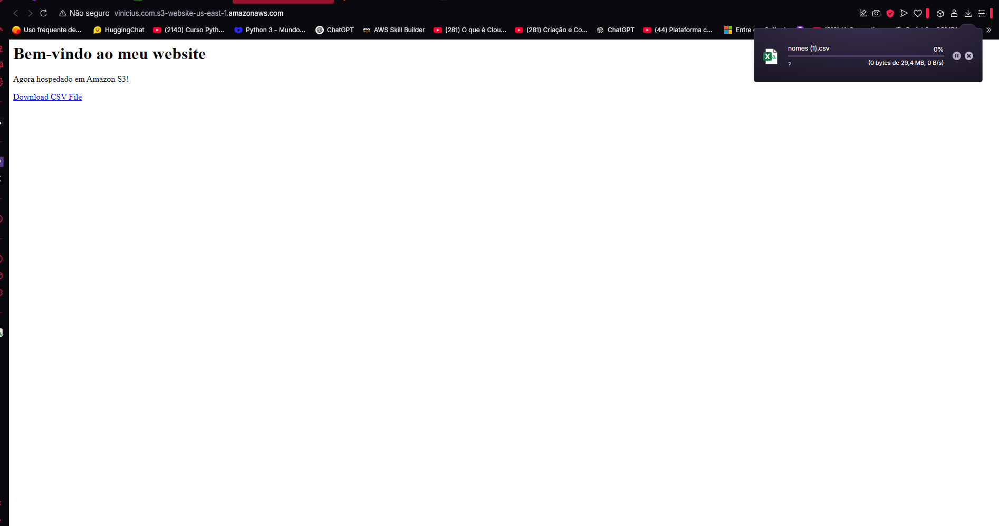
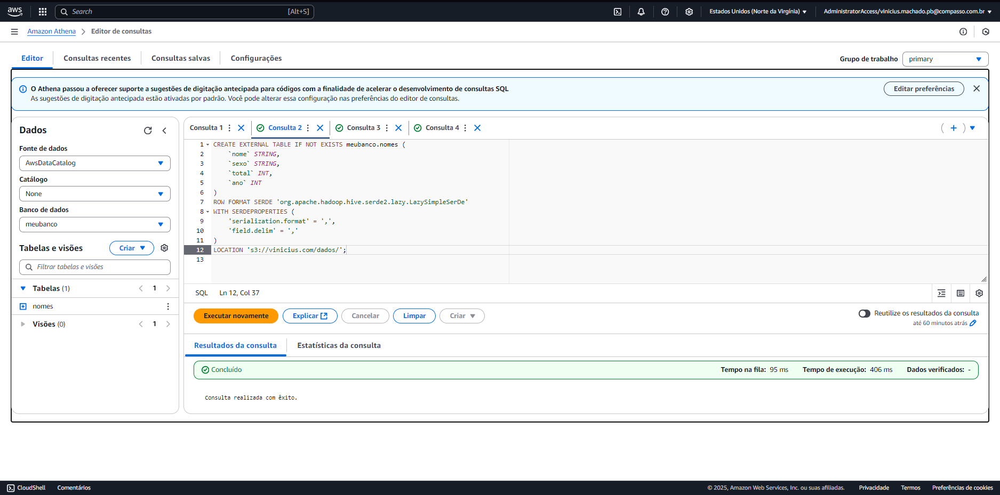
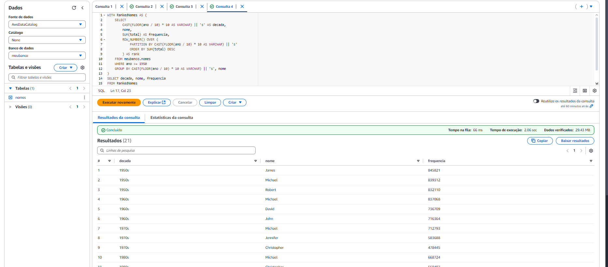
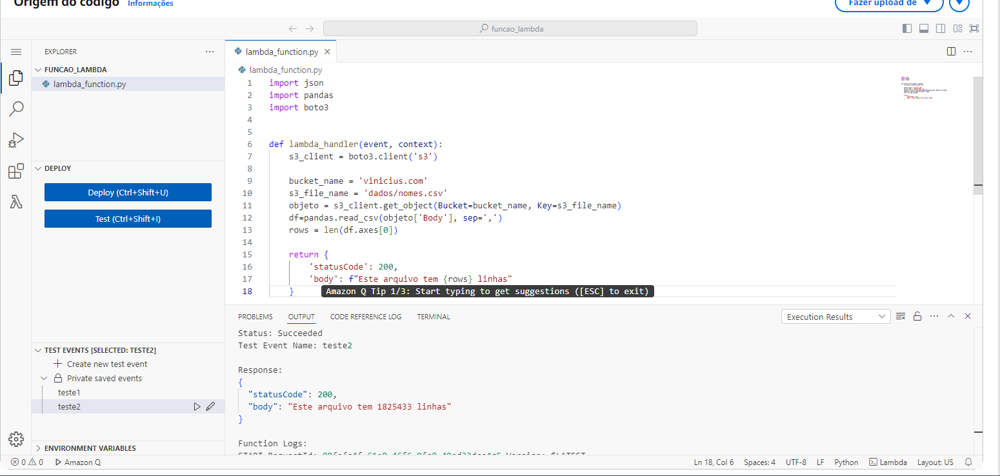

## Laboratório 1: Amazon S3 - Hospedagem de Site Estático

### Objetivo
Configurar um bucket no Amazon S3 para hospedar conteúdo estático, permitindo acesso público ao site e disponibilizando arquivos para download.

### O que foi feito

#### Etapa 1: Criação do Bucket
- Acessei o serviço **S3** no console da AWS.
- Criei um bucket com um nome exclusivo e selecionei a região **US East (N. Virginia)**.
- Mantive as configurações padrão para a criação do bucket.

#### Etapa 2: Habilitação da Hospedagem de Site Estático
- Ativei a opção de "Static Website Hosting" no bucket criado.
- Configurei o documento de índice como **index.html** e especifiquei o documento de erro como **404.html**.

#### Etapa 3: Configuração de Permissões
- Desativei o bloqueio de acesso público nas configurações do bucket para permitir acesso externo ao site.
- Adicionei uma política de bucket para conceder permissão de leitura pública ao conteúdo.

#### Etapa 4: Upload de Arquivos
- Fiz upload do arquivo **index.html** no bucket raiz.
- Criei uma pasta chamada **dados** dentro do bucket e carreguei o arquivo CSV destinado ao download.

#### Etapa 5: Teste do Endpoint
- Copiei o endpoint gerado na aba de "Static Website Hosting" e testei no navegador. O site foi carregado corretamente, mostrando o conteúdo configurado.

#### Evidência

---

## Laboratório 2: AWS Athena - Consulta de Dados

### Objetivo
Utilizar o AWS Athena para criar um banco de dados e executar consultas em arquivos armazenados no Amazon S3.

### O que foi feito

#### Etapa 1: Configuração do Bucket
- Verifiquei que o arquivo **nomes.csv** estava presente no bucket criado no laboratório anterior.
- Criei uma pasta chamada **queries** para armazenar os resultados das consultas.

#### Etapa 2: Configuração do Athena
- No console do Athena, configurei o local de resultados para apontar para a pasta **queries** do bucket no S3.
- Salvei as configurações para garantir que os resultados fossem armazenados corretamente.

#### Etapa 3: Criação de Banco de Dados e Tabela
- No editor de consultas do Athena, executei o comando **CREATE DATABASE** para criar o banco **meubanco**.
- Criei uma tabela para o banco utilizando a estrutura do arquivo CSV, especificando os nomes e tipos de dados das colunas. Também configurei o analisador **LazySimpleSerDe** para lidar com dados delimitados por vírgulas.

#### Etapa 4: Testes e Consultas
- Realizei consultas simples para verificar a importância dos dados.
- Criei uma consulta para listar os 3 nomes mais usados em cada década desde 1950. Os resultados foram armazenados no bucket configurado.

#### Evidências
- Criação da Tabela no Athena:  
  

- Resultado da Consulta dos 3 Nomes Mais Usados por Década:  
  
---

## Laboratório 3: AWS Lambda - Processamento com Pandas

### Objetivo
Criar uma função Lambda que utilize bibliotecas como Pandas para processar arquivos no Amazon S3.

### O que foi feito

#### Etapa 1: Criação da Função Lambda
- No console do Lambda, criei uma função com o runtime **Python 3.9**.
- Nomeei a função e configurei permissões padrão para acesso ao S3.

#### Etapa 2: Desenvolvimento do Código
- No editor do Lambda, substituí o código padrão para implementar uma função que:
  - Acesse um arquivo **CSV** no S3.
  - Utilize Pandas para contar o número de linhas do arquivo.
  - Retorne a contagem no formato JSON.
- Fiz o deploy do código atualizado.

#### Etapa 3: Criação de uma Layer
- Utilize Docker para criar uma layer contendo as bibliotecas **Pandas** e dependências.
- Segui os passos para criar uma imagem baseada no **Amazon Linux**, instalar o Python e compactar a pasta **python** contendo as bibliotecas.
- Fiz upload da layer gerada para o S3 e, posteriormente, adicionei à função Lambda.

#### Etapa 4: Testes
- Executei a função Lambda com um evento de teste e validei que o número de linhas do arquivo foi retornado corretamente.
- Ajustei os recursos (tempo limite e memória) para garantir a execução bem-sucedida.

#### Evidência
  

---
