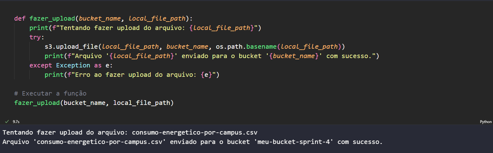

## Estrutura de Pastas
A pasta **Sprint 4** está organizada da seguinte forma:

```
Sprint 4/
├─ Certificados/  # Certificados conquistados durante a sprint, obtivemos certificados nessa sprint
├─ Desafio/       # Implementações e análises relacionadas ao desafio da sprint
├─ Evidencias/    # Imagens que comprovam a execução das atividades do desafio
├─ Exercicios/    # Resoluções dos exercícios práticos
└─ README.md      # Documentação da Sprint 4
```

---

## Certificados

Os certificados obtidos durante a Sprint 4 estão disponíveis na pasta [Certificados](Certificados/). Obtivemos certificados da AWS nesta sprint.

---
### Desafio

A pasta **[Desafio](Desafio/)** contém os artefatos necessários para as **Etapas 1 e 2** da Sprint 4. Aqui está uma visão geral:

- **Etapa 1: Upload e Gerenciamento de Arquivos no S3**  
  Esta etapa envolve a criação de um bucket no **AWS S3**, o upload de um arquivo CSV e a listagem dos arquivos no bucket. Todo o código está implementado no notebook `etapa1.ipynb`.

- **Etapa 2: Processamento e Análise de Dados**  
  Esta etapa é responsável por carregar os dados do **S3**, limpar e padronizar os valores, realizar análises e salvar os resultados. As implementações estão no notebook `etapa2.ipynb`.


---

## Evidências

As evidências para validação das análises e execuções realizadas estão armazenadas na pasta [Evidencias](Evidencias/). Esta pasta contém capturas de tela e outros registros que comprovam a execução das atividades da sprint.

Exemplo de evidência:



---

## Exercícios - Resumo dos Laboratórios

Os exercícios foram organizados seguindo a estrutura na Udemy.

## 🔹 Laboratório 1: Amazon S3 - Hospedagem de Site Estático

- Criado um bucket no **Amazon S3** com configurações padrão na região **US East (N. Virginia)**.
- Habilitada a hospedagem estática com `index.html` como página inicial e `404.html` para erros.
- Configuradas permissões públicas, incluindo política de leitura para acesso externo.
- Feito upload do arquivo `index.html` e um arquivo CSV na pasta `dados`.
- Testado o endpoint gerado, verificando que o site carregou corretamente.

---

## 🔹 Laboratório 2: AWS Athena - Consulta de Dados

- Configurado o Athena para armazenar os resultados na pasta `queries` do bucket S3.
- Criado um banco de dados chamado `meubanco` e uma tabela com base no arquivo `nomes.csv`.
- Executadas consultas, incluindo a listagem dos 3 nomes mais usados por década desde 1950.
- Resultados das consultas foram salvos no S3.

---

## 🔹 Laboratório 3: AWS Lambda - Processamento com Pandas

- Criada uma função **Lambda** com runtime **Python 3.9** para processar arquivos no S3.
- Desenvolvido código que utiliza **Pandas** para contar linhas de um arquivo CSV e retorna o resultado em JSON.
- Criada uma **layer** contendo **Pandas** e dependências usando Docker.
- Testada a função com eventos simulados, garantindo o processamento correto.

---


