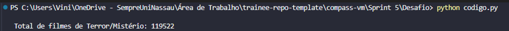
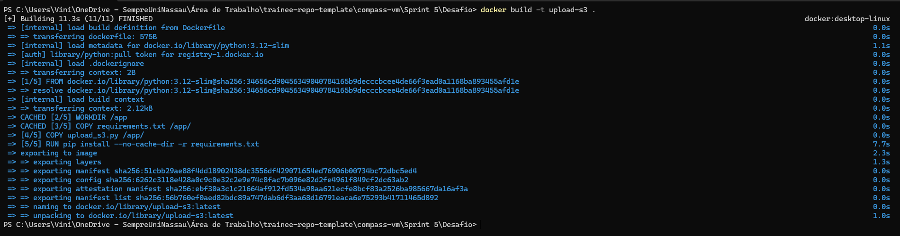
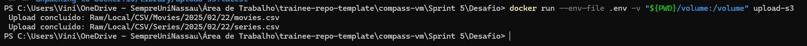
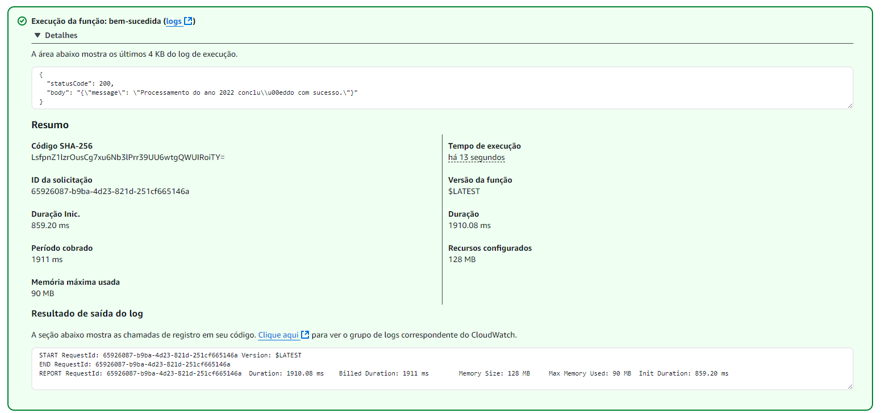
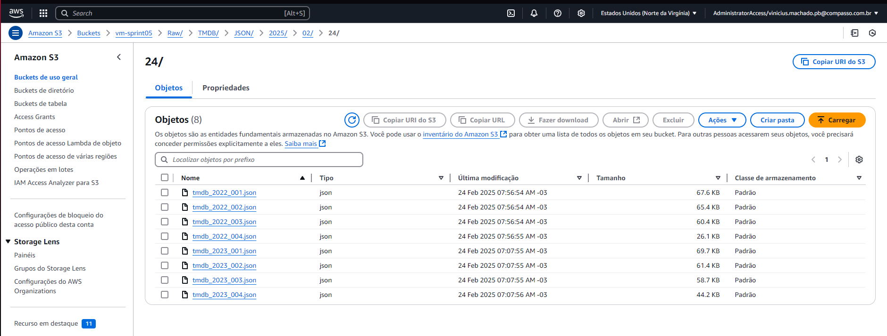

# Etapa 1 - Análise Inicial e Execução

## 1. Análises Iniciais
Antes de iniciar a execução da etapa-1, foi realizada uma análise inicial dos dados no arquivo CSV para identificar padrões e entender os tipos de dados presentes nesses arquivos.

Identificamos o total de filmes do tema da SQUAD 6:




## 2. Execução da Etapa-1

A etapa-1 consiste na preparação do ambiente e envio dos arquivos CSV para um bucket no Amazon S3.

### **Passo 1: Configuração do Ambiente e Arquivo .env**

As credenciais e configurações são armazenadas em um arquivo `.env`, garantindo modularidade e segurança.

**Exemplo do arquivo .env:**  
```ini
AWS_ACCESS_KEY_ID=SEU_ACCESS_KEY_ID
AWS_SECRET_ACCESS_KEY=SEU_SECRET_KEY
AWS_SESSION_TOKEN=SEU_SESSION_TOKEN
BUCKET_NAME=vm-sprint05
REGIAO=us-east-1
```

O código carrega essas variáveis utilizando a biblioteca `dotenv`:
```python
import os
from dotenv import load_dotenv

load_dotenv()
BUCKET_NAME = os.getenv("BUCKET_NAME")
REGIAO = os.getenv("REGIAO")
```

---

### **Passo 2: Construção do Container Docker e Montagem do Volume**

O processamento ocorre dentro de um container Docker, garantindo isolamento e consistência do ambiente.

#### **Dockerfile**
```dockerfile
FROM python:3.12-slim
WORKDIR /app

COPY requirements.txt ./
RUN pip install --no-cache-dir -r requirements.txt

COPY . .
VOLUME ["/data"]
CMD ["python", "upload_s3.py"]
```

Crie uma pasta /volume dentro da pasta da etapa-1 com os dois arquivos, eu já deixei a pasta criada dentro
da etapa-1, mas não subi os arquivos por recomendação nos slides do desafio.

#### **Construção da imagem:**
```sh
docker build -t container-etapa1 .
```

A estrutura do volume garante que os arquivos CSV sejam acessíveis dentro do container.

**Evidência:**  


---

### **Passo 3: Execução do Script de Upload para o S3**

Com o container configurado, o próximo passo é executar o script responsável pelo upload dos arquivos para o S3.

#### **Trecho do Código de Upload**
```python
import boto3
import os

def upload_to_s3(filename, bucket_name, s3_path):
    s3 = boto3.client('s3',
                      aws_access_key_id=os.getenv("AWS_ACCESS_KEY_ID"),
                      aws_secret_access_key=os.getenv("AWS_SECRET_ACCESS_KEY"),
                      aws_session_token=os.getenv("AWS_SESSION_TOKEN"))
    s3.upload_file(filename, bucket_name, s3_path)
    print(f"Upload concluído: {s3_path}")
```

**Execução do script:**  
```sh
docker run --rm -v $(pwd)/data:/data container-etapa1
```

---

### **Passo 4: Validação do Upload no S3**

A verificação dos logs confirma que os arquivos foram enviados corretamente.

**Evidência:**  


Os arquivos foram armazenados nos seguintes caminhos no S3:
```
S3://vm-sprint05/Raw/Local/CSV/Movies/2024/05/02/movies.csv
S3://vm-sprint05/Raw/Local/CSV/Series/2024/05/02/series.csv
```

---

# Etapa 2 - Ingestão de Dados do TMDB via AWS Lambda
---

## 1. Objetivo
O objetivo da etapa 2 é criar uma função AWS Lambda para consumir a API do TMDB e armazenar os dados no Amazon S3. Os arquivos são organizados na camada **RAW Zone**, no formato JSON, agrupados em arquivos de até 100 registros, estruturados por **ano/mês/dia**.

Antes da execução dessa etapa via AWS Lambda, fiz varios testes localmente, confirmei a lógica de paginação, a requisição deveria retornar um dicionário JSON contendo a chave "results" com uma lista de filmes, observei se estavam vindo respeitando a condição de 100 registros e que o arquivo JSON não passe de 10mb, armazenei os dados na minha máquina.

## 2. Estrutura do Projeto

O projeto segue a seguinte estrutura:

```
etapa-2/
├── lambda_function.py      # Código da função AWS Lambda
├── requirements.txt        # Lista de dependências
```

## 3. Configuração das Variáveis de Ambiente

A função Lambda utiliza duas variáveis de ambiente essenciais para o funcionamento:

- `TMDB_API_KEY`: Chave de acesso à API do TMDB.
- `S3_BUCKET`: Nome do bucket no S3 onde os arquivos JSON serão armazenados.

Essas variáveis devem ser configuradas no **console do AWS Lambda**, na seção de **Configurações** > **Variáveis de ambiente**.

## 4. Instalação de Dependências

Para garantir que o código tenha todas as bibliotecas necessárias ao ser enviado para o AWS Lambda, é necessário instalar as dependências dentro da pasta do projeto localmente.

O arquivo `requirements.txt` contém:

```txt
requests
```

Para instalar os pacotes localmente dentro do projeto:

```bash
pip install -r requirements.txt -t .
```

Esse comando instala as dependências na própria pasta do projeto, garantindo que elas estejam disponíveis no ambiente do AWS Lambda.

## 5. Preparação do Arquivo ZIP

Após instalar as dependências, a pasta deve ser compactada para que possa ser enviada ao AWS Lambda.

1. Acesse a pasta etapa-2.
2. Clique com o **botão direito do mouse** e selecione **"Enviar para > Pasta compactada (ZIP)"**.
3. Tudo dentro da pasta etapa-2 vai ser compactado, inclusive as dependências.
4. Você pode excluir a pasta bin se quiser, economizando espaço para subir ao lambda.
5. Não inclua o README.md no arquivo .zip que irá para o AWS Lambda.

## 6. Upload no AWS Lambda

1. Acesse o **AWS Lambda** no console da AWS.
2. Crie uma **nova função** ou edite uma existente.
3. Selecione **Carregar um arquivo .zip** e faça o upload do `lambda_function.zip` criado.
4. No campo **Handler**, defina:
   ```
   lambda_function.lambda_handler
   ```
5. Salve e configure a permissão no IAM.

## 7. Configuração de Permissões no IAM

Para que a função Lambda tenha permissão para escrever no Amazon S3, é necessário configurar a **função IAM** corretamente.

1. Acesse o **AWS IAM** no console da AWS.
2. Crie uma **nova função** e selecione **AWS Lambda** como serviço.
3. Crie uma política personalizada com a seguinte configuração:

```json
{
  "Version": "2012-10-17",
  "Statement": [
    {
      "Effect": "Allow",
      "Action": ["s3:PutObject", "s3:GetObject", "s3:ListBucket"],
      "Resource": [
        "arn:aws:s3:::NOME_DO_BUCKET",
        "arn:aws:s3:::NOME_DO_BUCKET/*"
      ]
    }
  ]
}
```

4. Salve e atribua essa função IAM à função Lambda criada.
5. Dessa forma é mais segura do que dar acesso completo ao S3 por exemplo.

# 8. Código da Função Lambda

A função Lambda é estruturada para separar bem as responsabilidades. As funções são pequenas e focadas em uma única tarefa, o que melhora a manutenção e facilita testes. O código foi escrito para garantir que a ingestão de dados seja eficiente e segura, lidando com erros de forma adequada.

---

## 8.1 Requisição à API do TMDB

A API do TMDB exige uma chave de autenticação para acessar os dados. A consulta é feita usando **requests**, pois é a opção mais direta e confiável para chamadas HTTP em Python. A URL da API é parametrizada para buscar apenas filmes de um determinado ano e paginar os resultados.

```python
def discover_filmes_por_ano(ano, page):
    url = "https://api.themoviedb.org/3/discover/movie"
    params = {
        'api_key': TMDB_API_KEY,
        'with_genres': "27,9648",
        'primary_release_year': ano,
        'page': page,
        'sort_by': 'popularity.desc'
    }
    try:
        response = session.get(url, params=params)
        response.raise_for_status()
        return response.json()
    except requests.RequestException as e:
        logging.error(f"Erro ao buscar dados do ano {ano}, página {page}: {e}")
        return None
```

###  Explicação

- O uso de **`requests.Session()`** melhora a eficiência, pois reutiliza conexões HTTP ao invés de abrir uma nova a cada requisição.
- O parâmetro **`page`** permite paginar os resultados, o que é necessário porque a API retorna no máximo **20 filmes por requisição**.
- A opção **`sort_by='popularity.desc'`** foi escolhida para garantir que os filmes mais populares sejam coletados primeiro.
- O **`.raise_for_status()`** levanta um erro se a requisição falhar, evitando que o código continue executando com respostas inválidas.

#### Evidência:

---

## 8.2 Salvando os Dados no S3

Os dados extraídos da API precisam ser armazenados de forma estruturada no S3. Os arquivos são organizados por **data de processamento** para garantir rastreabilidade. Cada arquivo contém no máximo **100 registros** para evitar arquivos muito grandes.

```python
def salvar_registros_s3(lista_registros, ano, contador_arquivo):
    hoje = datetime.utcnow()
    filename = f"tmdb_{ano}_{contador_arquivo:03d}.json"
    s3_key = f"Raw/TMDB/JSON/{hoje.year}/{hoje.month:02d}/{hoje.day:02d}/{filename}"
    
    try:
        s3_client.put_object(
            Bucket=S3_BUCKET,
            Key=s3_key,
            Body=json.dumps(lista_registros, ensure_ascii=False, indent=2),
            ContentType='application/json'
        )
        logging.info(f"Arquivo salvo no S3: s3://{S3_BUCKET}/{s3_key}")
        return True
    except Exception as e:
        logging.error(f"Erro ao salvar no S3: {e}")
        return False
```

###  Explicação

- O nome do arquivo segue o padrão **`tmdb_ano_contador.json`**, garantindo que os arquivos sejam organizados corretamente.
- A estrutura no **S3** segue `Raw/TMDB/JSON/ano/mês/dia/` para manter os arquivos organizados por **ano, mês e dia**.
- O **`json.dumps(lista_registros, ensure_ascii=False, indent=2)`** garante que os dados sejam salvos corretamente no formato JSON.
- O **`ContentType='application/json'`** foi definido explicitamente para que o arquivo seja reconhecido corretamente no S3.

#### Evidência:


---

## 8.3 Processamento dos Dados

O processamento precisa garantir que todos os dados do TMDB sejam recuperados e particionados corretamente antes de serem enviados ao S3. Como a API retorna no máximo **20 filmes por página**, a função precisa iterar sobre múltiplas páginas até não haver mais resultados.

```python
def processa_ano(ano):
    page = 1
    acumulador_registros = []
    contador_arquivo = 1

    while True:
        data = discover_filmes_por_ano(ano, page)
        if data is None or 'results' not in data:
            break

        results = data['results']
        if not results:
            break

        acumulador_registros.extend(results)

        while len(acumulador_registros) >= 100:
            salvar_registros_s3(acumulador_registros[:100], ano, contador_arquivo)
            contador_arquivo += 1
            acumulador_registros = acumulador_registros[100:]

        if len(results) < 20:
            break

        page += 1

    if acumulador_registros:
        salvar_registros_s3(acumulador_registros, ano, contador_arquivo)
```

###  Explicação

- Os registros são armazenados em uma lista (`acumulador_registros`). Sempre que essa lista atinge **100 registros**, um arquivo é salvo no S3.
- A **condição `if len(results) < 20:`** determina o momento de parar a paginação. Como a API retorna no máximo 20 resultados por página, quando essa condição for verdadeira, significa que não há mais dados para serem buscados.
- Se ainda houver registros no acumulador após o fim do loop, o último arquivo é salvo para garantir que nenhum dado seja perdido.

---

## 8.4 Handler da Função Lambda

O AWS Lambda executa o código a partir de um **handler**, que é o ponto de entrada da função. Ele recebe um evento de entrada e um contexto de execução, processa os parâmetros e inicia o fluxo de ingestão de dados.

```python
def lambda_handler(event, context):
    ano = event.get("year")
    if not ano:
        return {"statusCode": 400, "body": json.dumps({"error": "Parâmetro 'year' ausente."})}

    try:
        ano = int(ano)
    except ValueError:
        return {"statusCode": 400, "body": json.dumps({"error": "Ano inválido."})}

    processa_ano(ano)
    return {"statusCode": 200, "body": json.dumps({"message": f"Processamento do ano {ano} concluído."})}
```

###  Explicação

- O Lambda recebe um **evento JSON** contendo a chave `"year"`, que indica o ano dos filmes a serem buscados.
- Se a chave `"year"` não for encontrada, a execução é interrompida e um erro HTTP 400 é retornado.
- A conversão do ano para **inteiro** (`int(ano)`) evita que valores inválidos sejam processados. Caso a conversão falhe, um erro 400 é retornado.
- Após validar os parâmetros, a função `processa_ano(ano)` é chamada para iniciar a extração e armazenamento dos dados.
- Ao final da execução, um `statusCode: 200` é retornado, indicando sucesso.

---

Essa estrutura modular garante que cada parte do código tenha uma função clara:

- **Consulta à API:** `discover_filmes_por_ano`
- **Armazenamento no S3:** `salvar_registros_s3`
- **Gerenciamento do fluxo:** `processa_ano`
- **Ponto de entrada do Lambda:** `lambda_handler`

Isso facilita manutenções futuras e evita dependências desnecessárias entre as funções.

# 9. Teste da Função

1. No AWS Lambda, crie um evento de teste com o seguinte JSON:

```json
{
  "year": 2024
}
```

2. Execute o teste e verifique os logs no **Amazon CloudWatch** para confirmar a execução.
3. Acesse o **S3** e confira se os arquivos foram armazenados corretamente.

# 10. Análises possíveis com os dados do TMDB

A partir dos dados extraídos da API do TMDB para os gêneros **Terror** e **Mistério**, é possível realizar diversas análises para responder questões específicas sobre padrões e tendências desses filmes. Abaixo estão cinco possiveis análises baseadas nas métricas disponíveis.

---

## 1. Popularidade dos Filmes ao Longo do Tempo

**Métrica Utilizada:** `"popularity"`  
**Pergunta:** Como a popularidade dos filmes de terror e mistério varia ao longo dos anos?  
**Análise:** Podemos calcular a média de popularidade por ano para verificar tendências e identificar períodos em que esses gêneros ganharam ou perderam relevância. Isso pode mostrar anos com um aumento repentino no interesse do público por filmes desses gêneros.

---

## 2. Avaliação Média dos Filmes

**Métrica Utilizada:** `"vote_average"`  
**Pergunta:** A qualidade dos filmes de terror e mistério tem melhorado ao longo do tempo?  
**Análise:** Com a média de `"vote_average"` por ano, podemos verificar se os filmes lançados recentemente são melhor avaliados do que os filmes antigos. Isso pode indicar uma evolução na qualidade das produções ou mudanças na percepção do público.

---

## 3. Relação entre Volume de Lançamentos e Qualidade

**Métricas Utilizadas:** `"release_date"`, `"vote_average"`  
**Pergunta:** A quantidade de filmes lançados impacta na qualidade?  
**Análise:** Contando quantos filmes de terror e mistério foram lançados a cada ano e comparando com a avaliação média desses filmes, podemos analisar se um aumento no número de lançamentos impacta a qualidade percebida. Isso pode indicar períodos em que houve um crescimento excessivo de produções, possivelmente levando a uma queda na qualidade.

---

## 4. Identificação de Filmes de Sucesso Recente

**Métricas Utilizadas:** `"popularity"`, `"vote_average"`, `"release_date"`  
**Pergunta:** Quais filmes lançados recentemente tiveram um alto impacto?  
**Análise:** Filtrando os filmes lançados nos últimos anos e identificando aqueles com maior popularidade e melhores avaliações, podemos destacar as produções mais bem-sucedidas e entender as tendências atuais do gênero.

---

## 5. Filmes com Maior Número de Avaliações

**Métrica Utilizada:** `"vote_count"`  
**Pergunta:** Quais são os filmes mais discutidos dentro dos gêneros?  
**Análise:** Filmes com maior `"vote_count"` indicam alto engajamento dos espectadores. Isso pode revelar quais produções tiveram mais impacto e geraram discussões entre o público, independentemente da nota média recebida.


## 6. Distribuição Geográfica dos Filmes

**Métrica Utilizada:** `"original_language"`
**Pergunta:** Quais países produzem mais filmes de terror e mistério?
**Análise:**  Através do campo `"original_language"`, podemos verificar a predominância de idiomas nos filmes e inferir a origem das produções.

