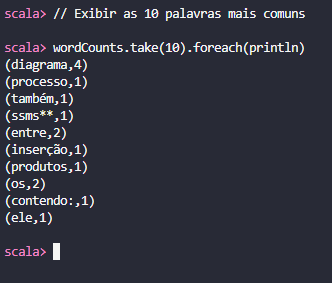
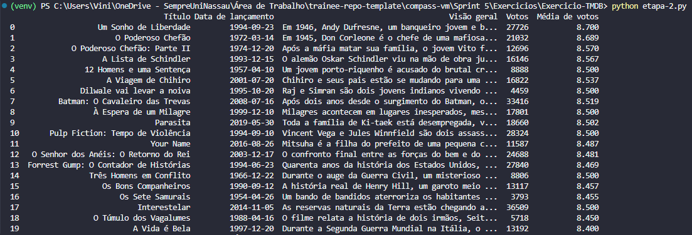

# Exercícios Sprint 5

Este documento contém as instruções detalhadas para a execução dos dois exercícios da Sprint 5:
1. **Processamento de Dados com Apache Spark e Docker** (Contador de palavras)
2. **Exercício TMDB** (Consulta à API de filmes)

---

## **1. Exercício: Processamento de Dados com Apache Spark e Docker**

Este projeto consiste na execução de um job de processamento utilizando o framework **Apache Spark** dentro de um **container Docker**. O objetivo é contar a ocorrência de palavras em um arquivo `README.md` hospedado em um repositório GitHub.

### **1.1. Configuração do Ambiente**

#### **Pré-requisitos**
- Docker instalado na máquina
- Acesso à internet para baixar a imagem e executar `wget`

#### **Etapa 1 - Download da Imagem Docker**
Para iniciar o processo, foi realizado o pull da imagem Docker necessária para rodar o ambiente Spark:

```sh
docker pull jupyter/all-spark-notebook
```

Essa imagem contém o Apache Spark e o Jupyter Lab pré-configurados.

#### **Etapa 2 - Criação e Execução do Container**
Após baixar a imagem, foi criado e iniciado um container Docker a partir da imagem `jupyter/all-spark-notebook`:

```sh
docker run -p 8888:8888 \
  -v "${PWD}/notebooks:/home/jovyan/work" \
  -v "${PWD}/data:/home/jovyan/data" \
  --name spark-container \
  jupyter/all-spark-notebook
```

O container foi configurado para expor a porta `8888`, permitindo acesso ao **Jupyter Lab** pelo navegador.

#### **Etapa 3 - Execução do PySpark**
Com o container em execução, foi aberto um **novo terminal** e executado o seguinte comando para acessar o shell do container:

```sh
docker exec -it spark-container bash
```

Dentro do container, foi inicializado o **PySpark** com:

```sh
pyspark
```

Foi encerrado o PySpark com:

```sh
exit()
```

#### **Etapa 4 - Contagem de Palavras no Arquivo README.md**
Para processar o arquivo `README.md`, foi necessário primeiro baixá-lo dentro do container utilizando o comando `wget`:

```sh
wget https://raw.githubusercontent.com/vmendess/cafelivraria_tech/main/README.md -O README.md
```

Foi então iniciado o **Spark Shell**, conforme exigido no enunciado:

```sh
spark-shell
```

Os seguintes comandos foram executados no **Spark Shell** para processar o arquivo e contar as ocorrências das palavras:

```scala
// Carregar o arquivo README.md
val rdd = sc.textFile("README.md")

// Transformar o texto em palavras individuais
val words = rdd.flatMap(line => line.split(" "))

// Remover palavras vazias
val filteredWords = words.filter(word => word.trim() != "")

// Criar pares (palavra, 1) e contar ocorrências
val wordCounts = filteredWords.map(word => (word.toLowerCase(), 1)).reduceByKey(_ + _)

// Exibir as 10 palavras mais comuns
wordCounts.take(10).foreach(println)
```

A saída gerada foi uma lista contendo as palavras mais frequentes e suas respectivas contagens.
#### Evidência:



---

## **2. Exercício: API TMDB**

Este exercício consiste na consulta de dados sobre filmes utilizando a API do **The Movie Database (TMDB)**. O meu objetivo foi buscar os **20 filmes mais bem avaliados**, exibindo título, data de lançamento, votos e média de avaliações.

### **2.1. Configuração do Ambiente**

#### **Passo 1: Criar e ativar o ambiente virtual**
```sh
python -m venv venv
# Ativar no Windows (PowerShell)
venv\Scripts\Activate
# Ativar no Windows (CMD)
venv\Scripts\activate.bat
# Ativar no Linux/macOS
source venv/bin/activate
```

#### **Passo 2: Criar o arquivo `.env` e adicionar as credenciais da API TMDB**
```
API_KEY=XXXXXX
TOKEN_API=XXXXXX
```

#### **Passo 3: Criar o arquivo `requirements.txt` e adicionar as dependências**
```
requests
pandas
python-dotenv
IPython
```

#### **Passo 4: Instalar as dependências**
```sh
pip install -r requirements.txt
```

#### **Passo 5: Configurar o interpretador Python no VS Code**
1. Abrir a paleta de comandos (`Ctrl + Shift + P`)
2. Selecionar **Python: Select Interpreter**
3. Escolher **"Enter interpreter path..."** e selecionar:
   ```
   compass-vm/Sprint 5/Exercicios/Exercicio-TMDB/venv/Scripts/python.exe
   ```

#### **Passo 6: Executar o código Python**
```sh
python etapa-2.py
```

### **2.2. Resultado esperado**
Tabela com os **20 filmes mais bem avaliados da API do TMDB**, incluindo:
- Título
- Data de lançamento
- Visão geral
- Votos
- Média de votos

#### Evidência:

