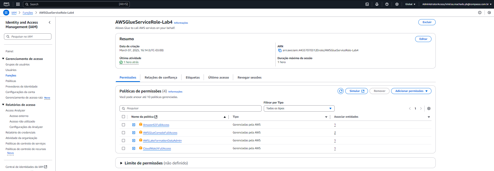
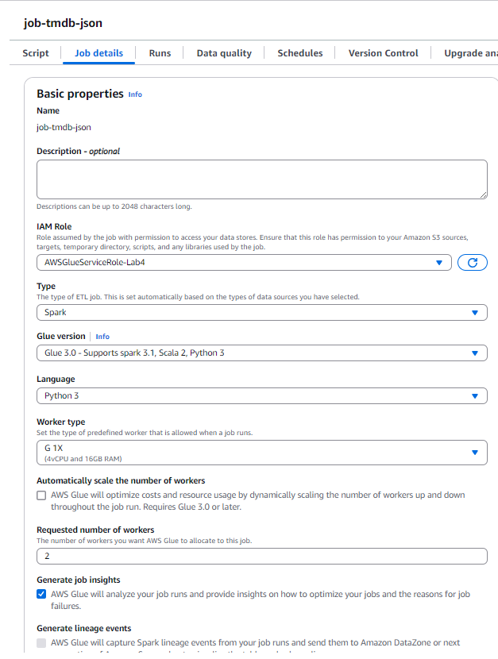
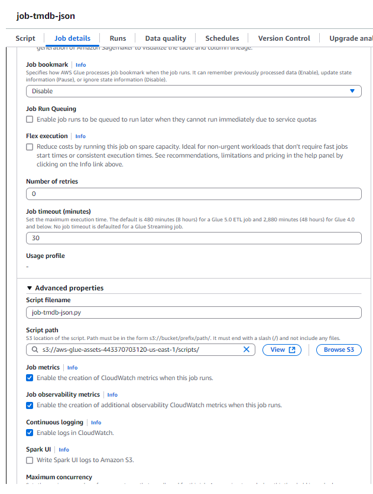
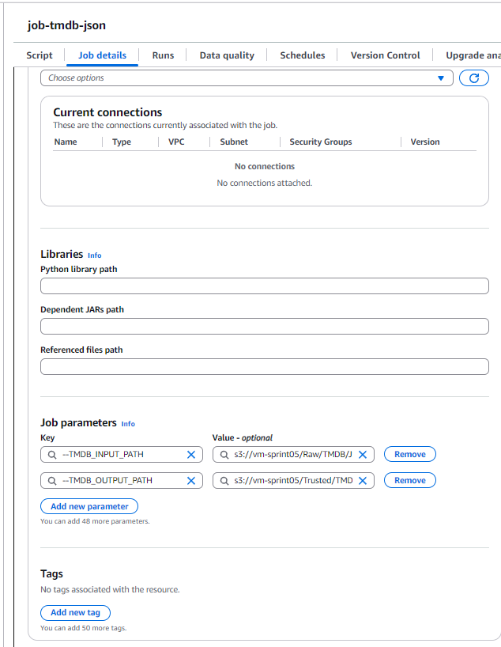
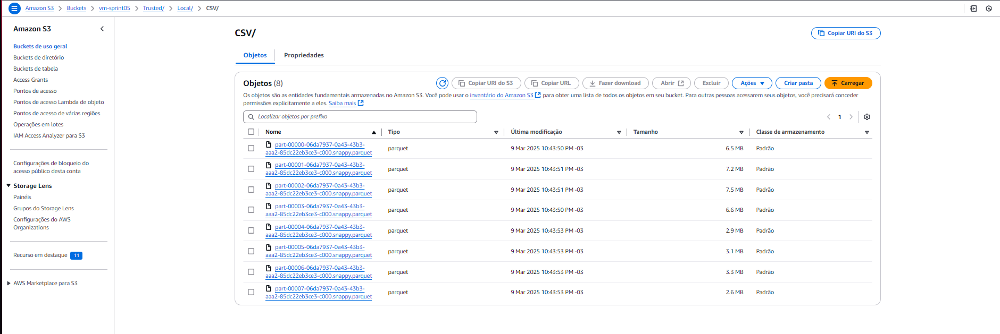
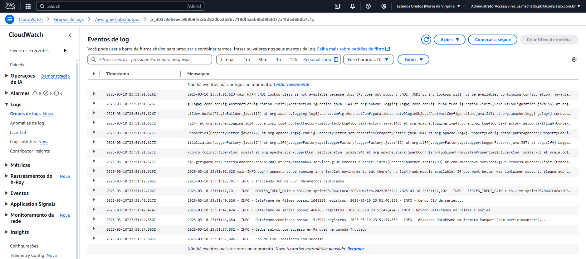
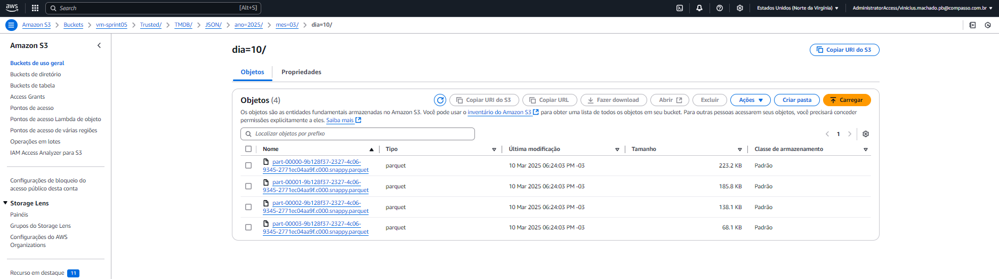
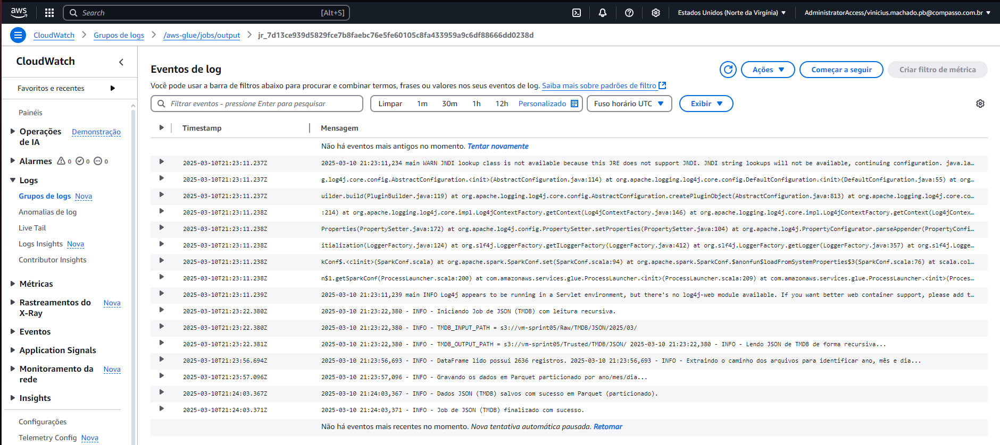
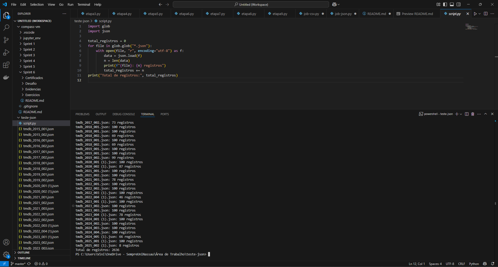
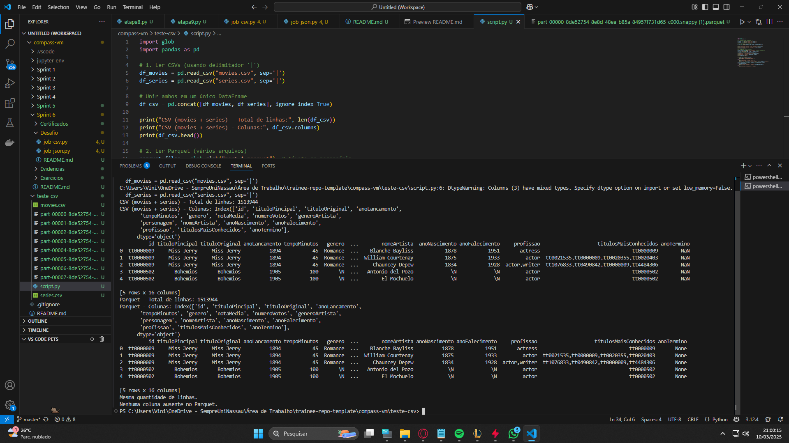

# AWS Glue ETL - Processamento de Dados CSV e JSON (TMDB)

Este projeto configura e executa dois jobs no AWS Glue para processar arquivos CSV e JSON, realizar transformações e salvar os resultados em formato Parquet na camada Trusted.

## **1. Preparação Inicial**

### IAM Role e Permissões
- Utilizei a role compatível `AWSGlueServiceRole-Lab4` que criei no lab com acesso a S3 (leitura em Raw e escrita em Trusted).  
- Políticas necessárias:
  - `AmazonS3FullAccess`
  - `AWSGlueConsoleFullAccess`
  - `AWSLakeFormationDataAdmin`
  - `CloudWatchFullAccess`

### Evidência: 



### Buckets S3
- **Raw Zone:** `s3://vm-sprint05/Raw/`  
- **Trusted Zone:** `s3://vm-sprint05/Trusted/`  

### Estrutura de Dados
- **CSV (Local):**
  - `s3://vm-sprint05/Raw/Local/CSV/Movies/2025/02/22/`  
  - `s3://vm-sprint05/Raw/Local/CSV/Series/2025/02/22/`  
- **JSON (TMDB):**
  - `s3://vm-sprint05/Raw/TMDB/JSON/2025/03/10/`  

### Evidências e padrões de configurações dos jobs:
- Configuração do meu job:






---

## **2. Código do Job de CSV**

### Captura de parâmetros
```python
args = getResolvedOptions(sys.argv, [
    'JOB_NAME',
    'MOVIES_INPUT_PATH',
    'SERIES_INPUT_PATH',
    'TRUSTED_CSV_OUTPUT_PATH'
])
```

### Inicialização do Spark e Glue Context
```python
sc = SparkContext()
glueContext = GlueContext(sc)
spark = glueContext.spark_session
job = Job(glueContext)
job.init(args['JOB_NAME'], args)
```

### Leitura dos arquivos CSV
```python
df_movies = spark.read.option("header", True).csv(args['MOVIES_INPUT_PATH'])
df_series = spark.read.option("header", True).csv(args['SERIES_INPUT_PATH'])
```

### União dos DataFrames
```python
df_all = df_movies.unionByName(df_series, allowMissingColumns=True)
```

### Escrita em formato Parquet
```python
df_all.write.mode("overwrite").format("parquet").save(args['TRUSTED_CSV_OUTPUT_PATH'])
```

### Finalização
```python
job.commit()
```

### Evidências:





---

## **3. Código do Job de JSON (TMDB)**

### Captura de parâmetros
```python
args = getResolvedOptions(sys.argv, [
    'JOB_NAME',
    'TMDB_INPUT_PATH',
    'TMDB_OUTPUT_PATH'
])
```

### Inicialização do Spark e Glue Context
```python
sc = SparkContext()
glueContext = GlueContext(sc)
spark = glueContext.spark_session
job = Job(glueContext)
job.init(args['JOB_NAME'], args)
```

### Leitura dos arquivos JSON (leitura recursiva)
```python
df_tmdb = spark.read     .option("recursiveFileLookup", "true")     .option("multiLine", True)     .json(args['TMDB_INPUT_PATH'])
```

### Extração de Data (ano, mês, dia) com regex
```python
def extract_date(path):
    match = re.search(r'/(\d{4})/(\d{2})/(\d{2})/', path)
    if match:
        return list(match.groups())
    else:
        return ["9999", "99", "99"]
extract_date_udf = F.udf(extract_date, ArrayType(StringType()))
df_tmdb = df_tmdb.withColumn("date_tuple", extract_date_udf(F.col("input_file")))
```

### Criação de colunas separadas (ano, mês, dia)
```python
df_tmdb = df_tmdb.withColumn("ano", F.col("date_tuple").getItem(0))                  .withColumn("mes", F.col("date_tuple").getItem(1))                  .withColumn("dia", F.col("date_tuple").getItem(2))
```

### Escrita em formato Parquet (particionado)
```python
df_tmdb.write     .mode("overwrite")     .partitionBy("ano", "mes", "dia")     .format("parquet")     .save(args['TMDB_OUTPUT_PATH'])
```

### Finalização
```python
job.commit()
```

### Evidência:



---

## **4. Execução dos Jobs**
1. Executar o job de CSV.  
2. Executar o job de JSON (TMDB).  
3. Monitorar o progresso e erros no **CloudWatch**.  
4. Verificar os arquivos Parquet salvos na camada Trusted.  

### Evidência no log do Amazon CloudWatch:


---

## **5. Exemplo de validação dos arquivos .parquet**
- Criei um script python que conta os registros de todos os arquivos JSON do TMDB.
- Comparei o total de registros lidos pelo programa pelo total lido pelo job e são iguais: **2636** registros.
- Da mesma forma fiz com o job do csv, contei todo o conteúdo presente nos dois arquivos (linhas e colunas).
### Evidências:






# **Estrutura Final de Saída**
```
s3://vm-sprint05/Trusted/Local/CSV/Movies/2025/02/22/  
s3://vm-sprint05/Trusted/Local/CSV/Series/2025/02/22/  
s3://vm-sprint05/Trusted/TMDB/JSON/2025/03/10/  
```
