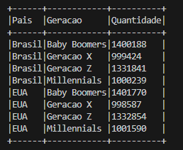

# Exercicios

Este documento descreve as etapas para geração e análise da massa de dados utilizando Python e Apache Spark, detalhando comandos utilizados, trechos de código e justificativas das decisões técnicas.

## Configuração Inicial

Antes de executar os scripts Apache Spark, é necessário configurar corretamente as variáveis de ambiente para Spark e Python no terminal (PowerShell):

```powershell
$env:SPARK_HOME = "C:\spark-3.5.5-bin-hadoop3"
$env:PATH = "$env:SPARK_HOME\bin;$env:PATH"
$env:PYSPARK_PYTHON = "C:\Users\Vini\AppData\Local\Programs\Python\Python312\python.exe"

# Testar instalação
spark-submit --version
```

**Justificativa**:  
- `SPARK_HOME`: Aponta para o diretório onde o Spark está instalado. Deve ser adaptado conforme o ambiente local.  
- `PYSPARK_PYTHON`: Garante que o Spark use a versão correta do Python instalada localmente. Deve ser adaptado para o caminho exato do Python no ambiente do usuário (coloquei a minha como exemplo).

**Observação de Compatibilidade**: Esses caminhos são específicos ao ambiente original de desenvolvimento e devem ser ajustados conforme o ambiente de execução de terceiros.

---

## Parte 1 – Geração de Massa de Dados

### Etapa 1 – Números Aleatórios Invertidos

```python
import random

numeros = []
for _ in range(250):
    numeros.append(random.randint(1, 1000))

numeros.reverse()
print(numeros)
```

**Justificativa**: O uso do `reverse()` simplifica a inversão direta dos elementos da lista.

---

### Etapa 2 – Geração e Ordenação de Animais

```python
animais = [
    'hipopótamo', 'pinguim', 'água-viva', 'raposa', 'camelo',
    'tubarão', 'borboleta', 'castor', 'esquilo', 'gorila',
    'lontra', 'pato', 'baleia', 'foca', 'urso-polar',
    'veado', 'canguru', 'guaxinim', 'morcego', 'rinoceronte'
]

animais.sort()

[print(animal) for animal in animais]

with open('animais.txt', 'w', encoding='utf-8') as arquivo:
    for animal in animais:
        arquivo.write(animal + '\n')
```

---

### Etapa 3 – Arquivo Grande de Nomes Aleatórios

```python
import random, names

random.seed(40)
nomes_unicos = [names.get_full_name() for _ in range(39080)]

with open('nomes_aleatorios.txt', 'w', encoding='utf-8') as arquivo:
    for _ in range(10000000):
        arquivo.write(random.choice(nomes_unicos) + '\n')
```

---

## Parte 2 – Análise com Apache Spark

## Etapa 1
Inicialmente, prepararemos o ambiente, definindo o diretório onde nosso código será desenvolvido. Para este diretório, copiaremos o arquivo `nomes_aleatorios.txt`.

Em nosso script Python, importaremos as bibliotecas necessárias:

```python
from pyspark.sql import SparkSession
from pyspark import SparkContext, SQLContext

# Inicializando SparkSession com suporte a SQL
spark = SparkSession     .builder     .master('local[*]')     .appName('Exercicio Intro')     .getOrCreate()

# Carregando o arquivo nomes_aleatorios.txt como CSV (cada linha é uma entrada)
df_nomes = spark.read.csv('nomes_aleatorios.txt', header=False, inferSchema=True)

# Exibindo as 5 primeiras linhas do DataFrame
df_nomes.show(5)

# Finalizando a sessão Spark após o uso
spark.stop()
```

### Explicação
- `SparkSession`: Classe para criar uma sessão do Spark.
- `master("local[*]")`: Define que o Spark rodará localmente usando todos os núcleos disponíveis.
- `appName("Exercicio Intro")`: Define o nome da aplicação.
- `read.csv(...)`: Lê o arquivo CSV sem cabeçalho (`header=False`) e tenta inferir os tipos de dados (`inferSchema=True`).
- `show(5)`: Exibe as 5 primeiras linhas para verificação.

### Evidência:


---

## Etapa 2
Agora vamos renomear a coluna `_c0` para `Nomes` e verificar o schema do dataframe.

```python
from pyspark.sql import SparkSession
from pyspark import SparkContext, SQLContext

# Inicializando a SparkSession
spark = SparkSession.builder     .master("local[*]")     .appName("Etapa2RenomearColuna")     .getOrCreate()

# Lê o arquivo nomes_aleatorios.txt (sem cabeçalho, schema inferido)
df_nomes = spark.read.csv("nomes_aleatorios.txt", header=False, inferSchema=True)

# Renomeia a coluna '_c0' para 'Nomes'
df_nomes = df_nomes.withColumnRenamed("_c0", "Nomes")

# Imprime o schema (para ver o tipo de cada coluna)
df_nomes.printSchema()

# Mostra as 10 primeiras linhas
df_nomes.show(10)

# Finaliza a sessão Spark
spark.stop()
```

### Explicação
- `withColumnRenamed("_c0", "Nomes")`: Renomeia a coluna `_c0` para `Nomes`.
- `printSchema()`: Mostra o schema do DataFrame.

### Evidência:


---

## Etapa 3
Adicionar uma nova coluna chamada `Escolaridade` com valores aleatórios (`Fundamental`, `Medio`, `Superior`).

```python
from pyspark.sql import SparkSession
from pyspark.sql.functions import rand, when, col

spark = SparkSession.builder     .master("local[*]")     .appName("Etapa3AdicionarEscolaridade")     .getOrCreate()

df_nomes = spark.read.csv("nomes_aleatorios.txt", header=False, inferSchema=True)

df_nomes = df_nomes.withColumnRenamed("_c0", "Nomes")

df_nomes = df_nomes.withColumn("rand_val", rand())

df_nomes = df_nomes.withColumn(
    "Escolaridade",
    when(col("rand_val") < 0.33, "Fundamental")
     .when((col("rand_val") >= 0.33) & (col("rand_val") < 0.66), "Medio")
     .otherwise("Superior")
)

df_nomes = df_nomes.drop("rand_val")

df_nomes.printSchema()
df_nomes.show(10)

spark.stop()
```

### Explicação
- `rand()`: Gera um valor aleatório entre 0 e 1.
- `when(...)`: Define os valores de forma condicional.

### Evidência:


---

## Etapa 4
Adicionar uma nova coluna chamada `Pais` com valores aleatórios de uma lista de países da América do Sul.

```python
from pyspark.sql import SparkSession
from pyspark.sql.functions import array, lit, floor, rand

spark = SparkSession.builder     .master("local[*]")     .appName("Etapa4AdicionarPais")     .getOrCreate()

df_nomes = spark.read.csv("nomes_aleatorios.txt", header=False, inferSchema=True)
df_nomes = df_nomes.withColumnRenamed("_c0", "Nomes")

paises = array(
    lit("Argentina"), lit("Bolivia"), lit("Brasil"), lit("Chile"), lit("Colombia"),
    lit("Equador"), lit("Guiana"), lit("Paraguai"), lit("Peru"), lit("Suriname"),
    lit("Uruguai"), lit("Venezuela"), lit("Guiana Francesa")
)

df_nomes = df_nomes.withColumn("Pais", paises.getItem(floor(rand() * 13).cast("int")))

df_nomes.printSchema()
df_nomes.show(10)

spark.stop()
```

### Explicação
- `array(...)`: Cria um array de países.
- `floor(rand() * 13)`: Retorna um valor aleatório entre 0 e 12.

### Evidência:


---

## Etapa 5
Adicionar uma nova coluna chamada `AnoNascimento` com valores aleatórios entre 1945 e 2010.

```python
from pyspark.sql.functions import floor, rand

df_nomes = df_nomes.withColumn("AnoNascimento", floor(rand() * 66) + 1945)
df_nomes.printSchema()
df_nomes.show(10)
```

### Explicação
- `floor(rand() * 66) + 1945`: Retorna valores de 1945 a 2010.

### Evidência:


---

## Etapa 6
Filtrar as pessoas que nasceram a partir de 2001.

```python
from pyspark.sql.functions import col

df_select = df_nomes.select("Nomes").where(col("AnoNascimento") >= 2001)
df_select.show(10)
```

### Explicação
- `where(col(...))`: Filtra valores específicos.

### Evidência:


---

## Etapa 7
Usar `SparkSQL` para repetir o filtro da Etapa 6.

```python
df_nomes.createOrReplaceTempView("pessoas")
df_select = spark.sql("SELECT Nomes FROM pessoas WHERE AnoNascimento >= 2001")
df_select.show(10)
```

### Explicação
- `createOrReplaceTempView`: Cria uma tabela temporária para consultas SQL.
- `spark.sql(...)`: Permite realizar consultas usando SQL diretamente.

### Evidência:


---

### Etapa 8 – Número de Pessoas da geração Millennials

```python
from pyspark.sql import SparkSession
from pyspark.sql.functions import col, floor, rand

spark = SparkSession.builder.master("local[*]").appName("Etapa8Millennials").getOrCreate()

df_nomes = spark.read.csv("../nomes_aleatorios.txt", header=False, inferSchema=True)
df_nomes = df_nomes.withColumnRenamed("_c0", "Nomes")
df_nomes = df_nomes.withColumn("AnoNascimento", floor(rand()*75 + 1940))

millennials = df_nomes.filter((col("AnoNascimento") >= 1980) & (col("AnoNascimento") <= 1994))

print("Numero de pessoas Millennials no dataset:", millennials.count())

spark.stop()
```

### Evidência:


---

### Etapa 9 – Repetir o processo da etapa 8 utilizando Spark SQL

```sql
SELECT COUNT(*) AS Quantidade_Millennials
FROM pessoas
WHERE AnoNascimento BETWEEN 1980 AND 1994
```

### Evidência:


---

### Etapa 10 – Spark SQL, quantiade de pessoas de cada país para cada uma das gerações: Baby Boomers, Geração X, Millennials, Geração Z

```sql
SELECT Pais, 
       CASE
          WHEN AnoNascimento BETWEEN 1944 AND 1964 THEN 'Baby Boomers'
          WHEN AnoNascimento BETWEEN 1965 AND 1979 THEN 'Geracao X'
          WHEN AnoNascimento BETWEEN 1980 AND 1994 THEN 'Millennials'
          WHEN AnoNascimento BETWEEN 1995 AND 2015 THEN 'Geracao Z'
       END AS Geracao,
       COUNT(*) AS Quantidade
FROM pessoas
WHERE AnoNascimento BETWEEN 1944 AND 2015
GROUP BY Pais, Geracao
ORDER BY Pais ASC, Geracao ASC, Quantidade ASC
```

### Evidência:



---

## Recomendações de Compatibilidade

Para replicar o ambiente, são necessárias as seguintes adaptações:

- **Caminhos** das variáveis de ambiente ajustados à instalação local.
- Versões recomendadas:
  - Apache Spark: `3.5.5-bin-hadoop3`
  - Python: `3.12`

---

# LAB AWS GLUE

Vou descrever, passo a passo, o processo realizado no **Lab Glue**, detalhando como o script em Python foi escrito para ler dados de um CSV no Amazon S3, transformá-los com PySpark e gravá-los novamente no S3 em formato particionado. As consultas de estatísticas foram executadas posteriormente no Amazon Athena.

---

## 1. Preparando o Bucket S3

1. Criar um bucket, como `lab-glue-sprint-6`.
2. Fazer upload do arquivo **nomes.csv** para o caminho `s3://lab-glue-sprint-6/lab-glue/input/nomes.csv`.

## Evidência:


---

## 2. Criação da Role IAM

1. No console do **IAM**, criar uma nova role confiando em “AWS Service” → “Glue”.
2. Associar permissões para que o AWS Glue possa ler/escrever no Amazon S3 e registrar logs (por exemplo, **AmazonS3FullAccess**, **AWSGlueConsoleFullAccess**, **CloudWatchFullAccess**, **AWSLakeFormationDataAdmin**).
3. Definir o nome da role, por exemplo **AWSGlueServiceRole-Lab4**.

## Evidência:


---

## 3. Configuração no AWS Lake Formation

O **AWS Lake Formation** é um serviço que facilita a criação e o gerenciamento de data lakes. Ele permite o controle detalhado de acesso e facilita a integração com outros serviços da AWS, como o Glue e o Athena.

### Criação de banco de dados no Lake Formation

1. No console da AWS, acessar o serviço **Lake Formation**.
2. No primeiro acesso, será exibida uma tela solicitando configuração inicial.
3. Selecionar a opção **Add myself** para se adicionar como administrador.
4. Clicar em **Get Started** para iniciar a configuração.

### Criação de banco de dados para o Crawler

1. Acessar o menu **Databases** dentro do Lake Formation.
2. Clicar em **Create database**.
3. Definir o nome do banco de dados, por exemplo **glue-lab**.
4. Selecionar a opção **Use only IAM access control**.
5. Salvar a configuração. 

---

## 4. Criação do Job no AWS Glue

1. Em **AWS Glue**, acessar **Jobs** > **Visual ETL** > **Script editor** (ou outro método preferencial).
2. Definir o nome do job, por exemplo `job_aws_glue_lab`.
3. Escolher a **Glue Version** (Glue 3.0) e **Python 3**.
4. Selecionar a IAM Role criada (ex.: **AWSGlueServiceRole-Lab4**).
5. Configurar número de workers, timeout, etc.
6. Substituir o conteúdo do editor pelo script exibido na seção anterior.
7. Salvar e **executar** o job.

---

## 5. Script do Job Glue

A seguir está o **trecho de código** utilizado para o job de ETL no AWS Glue. Ele faz a leitura do CSV, converte a coluna `nome` para maiúsculo e escreve os resultados em **JSON** particionado por `sexo` e `ano` no S3.

```python
import sys
import logging
from awsglue.transforms import *
from awsglue.utils import getResolvedOptions
from awsglue.context import GlueContext
from awsglue.job import Job
from pyspark.context import SparkContext
from pyspark.sql import functions as F

# Configura o root logger e redireciona para stdout
root_logger = logging.getLogger()
root_logger.setLevel(logging.INFO)

handler = logging.StreamHandler(sys.stdout)
formatter = logging.Formatter('%(asctime)s %(levelname)s %(message)s')
handler.setFormatter(formatter)
root_logger.addHandler(handler)

logger = root_logger  # Usaremos 'logger' para logar

# Inicializa contexto Glue
args = getResolvedOptions(sys.argv, ['JOB_NAME'])
sc = SparkContext()
glueContext = GlueContext(sc)
spark = glueContext.spark_session
job = Job(glueContext)
job.init(args['JOB_NAME'], args)

# Leitura do arquivo CSV no S3
input_path = 's3://lab-glue-sprint-6/lab-glue/input/nomes.csv'
df = spark.read.option('header', 'true').option('inferSchema', 'true').csv(input_path)

# Imprime o schema do DataFrame
df.printSchema()

# Altera a coluna 'nome' para MAIÚSCULO
df_upper = df.withColumn('nome', F.upper(F.col('nome')))

# Escrever no S3 em formato JSON, particionado por sexo e ano
output_path = 's3://lab-glue-sprint-6/lab-glue/frequencia_registro_nomes_eua/'
df_upper.write.mode('overwrite') \
    .partitionBy('sexo', 'ano') \
    .json(output_path)

# Finaliza o Job Glue
job.commit()
```

### Observações sobre o Script

- **Leitura do CSV**: Acontece com `.csv(input_path)`, habilitando `header` e `inferSchema`.
- **Transformação**: Apenas uma conversão simples de `nome` para maiúsculo com `F.upper`.
- **Gravação**: Em formato **JSON** no mesmo bucket, mas em um subdiretório `frequencia_registro_nomes_eua`, particionado pelas colunas `sexo` e `ano`.
- Nenhuma contagem ou agrupamento é exibido via script, pois as análises foram feitas no **Amazon Athena**.

## Evidência:


---

## 6. Criação e Execução do Crawler

1. Ainda no console do **AWS Glue**, acessar **Crawlers**.
2. Criar um novo Crawler que aponte para o subdiretório: `s3://lab-glue-sprint-6/lab-glue/frequencia_registro_nomes_eua/`.
3. Definir a role (ex.: **AWSGlueServiceRole-Lab4**).
4. Escolher o banco de dados `glue-lab` (ou outro criado previamente no Lake Formation).
5. Executar o crawler. Ao final, o Glue criará/atualizará a tabela (por exemplo `frequencia_registro_nomes_eua`) no catálogo.

---

## 7. Consultas no Athena

Após o **crawler** registrar a tabela no Glue Catalog, é possível acessar o **Amazon Athena** e executar consultas SQL sobre os dados particionados. Por exemplo:

```sql
SELECT COUNT(*) AS total_linhas
FROM frequencia_registro_nomes_eua;

SELECT *
FROM frequencia_registro_nomes_eua
LIMIT 10;
```

## Evidências:


