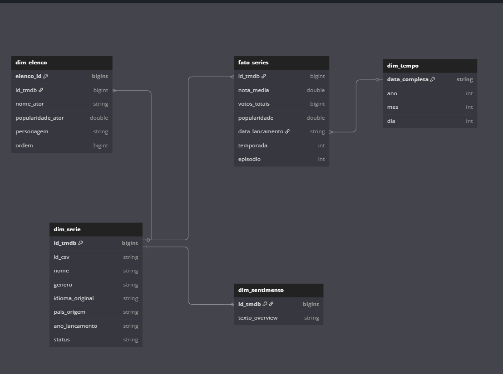
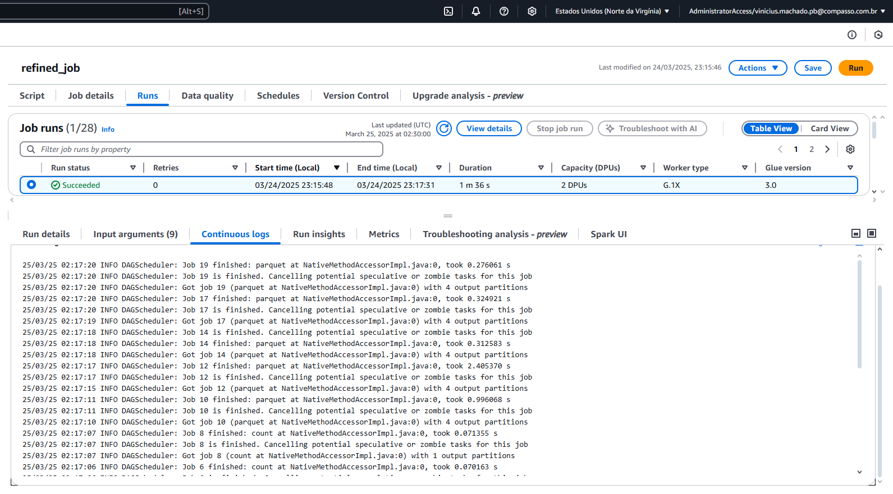
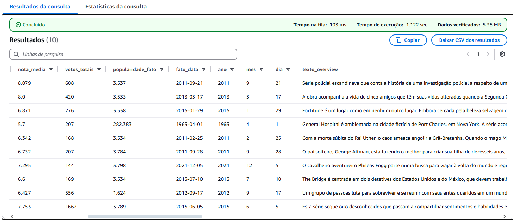

# Desafio: Criação da Camada Refined no AWS Glue

## 1. Descrição do Desafio
Este desafio consiste em criar um **job do AWS Glue** que leia dados da camada Trusted (armazenados em formato Parquet/CSV no S3), aplique transformações e gere tabelas na camada **Refined**. O objetivo é organizar os dados em um modelo dimensional, facilitando consultas e análises posteriores, por exemplo, no Amazon Athena.

## Anagrama do modelo dimensional:



## 2. Tecnologias Utilizadas
- **AWS Glue** para orquestração e execução do job.
- **PySpark** (dentro do Glue) para leitura, transformação e gravação dos dados.
- **Amazon S3** como data lake para armazenar os arquivos Trusted e Refined.
- **Amazon Athena** (opcional) para consultas e validações.

## 3. Arquitetura e Modelo de Dados
A arquitetura segue o fluxo:
1. **Trusted**: Armazena dados após processos de limpeza básicos.
2. **Refined**: Recebe dados prontos para análise, organizados em Fatos e Dimensões.

### Modelo de Dados da Camada Refined
O modelo é composto pelas seguintes tabelas:

1. **fato_series**  
   - `id_tmdb` (bigint)  
   - `nota_media` (double)  
   - `votos_totais` (bigint)  
   - `popularidade` (double)  
   - `data_lancamento` (string)  
   - `temporada` (int)  
   - `episodio` (int)

2. **dim_serie**  
   - `id_tmdb` (bigint)  
   - `id_csv` (string)  
   - `nome` (string)  
   - `genero` (string)  
   - `idioma_original` (string)  
   - `pais_origem` (string)  
   - `ano_lancamento` (string)  
   - `status` (string)

3. **dim_elenco**  
   - `elenco_id` (bigint)  
   - `id_tmdb` (bigint)  
   - `nome_ator` (string)  
   - `popularidade_ator` (double)  
   - `personagem` (string)  
   - `ordem` (bigint)

4. **dim_tempo**  
   - `data_completa` (string)  
   - `ano` (int)  
   - `mes` (int)  
   - `dia` (int)

5. **dim_sentimento**  
   - `id_tmdb` (bigint)  
   - `texto_overview` (string)

Essas tabelas são salvas em formato **Parquet** na camada Refined.

## 4. Passo a Passo do Job
Abaixo, um resumo das etapas do arquivo `refined_job.py`:

1. **Captura dos Parâmetros e Inicialização**  
   - Recebe o nome do job via `getResolvedOptions`.
   - Inicializa o SparkContext e o GlueContext.

2. **Definição dos Caminhos S3**  
   - `TRUSTED_PATH` aponta para a localização dos dados Trusted.  
   - `REFINED_PATH` aponta para a localização dos dados Refined.

3. **Leitura dos Dados**  
   - Lê tabelas Parquet/CSV da camada Trusted (`df_reviews`, `df_detalhes`, `df_csv`, etc.).

4. **Criação das Tabelas**  
   - **Fato (fato_series)**: Seleciona campos relevantes (nota média, votos, data de lançamento, etc.).  
   - **Dimensão Série (dim_serie)**: Une dados de diferentes fontes (JSON e CSV), criando colunas com chaves separadas (`id_tmdb` e `id_csv`).  
   - **Dimensão Elenco (dim_elenco)**: Explode o campo de créditos para obter detalhes do elenco (atores, popularidade, personagens).  
   - **Dimensão Tempo (dim_tempo)**: Extrai ano, mês e dia a partir da data de lançamento.  
   - **Dimensão Sentimento (dim_sentimento)**: Armazena o overview (texto) para análises textuais.

5. **Escrita na Camada Refined**  
   - Escreve cada DataFrame em formato Parquet no S3, usando `mode("overwrite")`.

6. **Finalização**  
   - Exibe mensagens de conclusão e chama `job.commit()`.

## 5. Evidências e Prints

### 5.1. Execução do Job no AWS Glue



### 5.2. Estrutura no S3


### 5.3. Consultas no Athena

A consulta a seguir foi desenvolvida para validar a consistência do nosso modelo dimensional. Ela integra as principais tabelas do modelo (fato e dimensões) e permite verificar se os dados foram carregados corretamente e se os relacionamentos estão funcionando conforme esperado.

## O que a consulta faz:

- **Join entre Fato e Dimensão de Séries (dim_serie):**  
  A união é realizada pelo campo `id_tmdb`. Essa junção garante que os detalhes da série (como nome, gênero, idioma, país de origem, ano de lançamento e status) estejam associados corretamente aos indicadores de desempenho (nota média, votos totais e popularidade) presentes na tabela fato.

- **Integração com a Dimensão de Tempo (dim_tempo):**  
  A junção pelo campo `data_lancamento` com `data_completa` permite extrair os componentes temporais (ano, mês e dia) da data de lançamento da série. Isso possibilita análises temporais e valida que a extração de data foi feita de forma correta.

- **Integração com a Dimensão de Sentimento (dim_sentimento):**  
  Ao unir pelo campo `id_tmdb`, verificamos se os textos dos overviews das séries foram capturados corretamente, permitindo futuras análises de sentimento e texto.

- **Integração com a Dimensão de Elenco (dim_elenco):**  
  A consulta também une com a dimensão de elenco para exibir informações sobre os atores (nome do ator, personagem e popularidade) associados à série. Essa união ajuda a confirmar que os dados do elenco foram processados corretamente e estão relacionados à série correta.

## Acabei descobrindo que 2 tabelas com IDS os dados foram perdidos, identifiquei o problema no job da camada Trusted (Desafio Sprint 6), fiz consultas nos arquivos .parquet e identifiquei a fonte do problema, os dados de 2 colunas de IDS, ficaram nulos.
- Irei corrigir para conseguir a eficácia do modelo dimensional e obter resultados concretos.
- Pelo prazo da sprint 7, não consegui corrigir a tempo, mas pretendo ter um bom resultado final.



## 6. Como Executar
1. Faça o upload do arquivo `refined_job.py` no AWS Glue Scripts (ou utilize um bucket S3 de scripts).  
2. Crie ou edite um Job no Glue, referenciando esse script.  
3. Configure as conexões, IAM Role e parâmetros necessários (ex.: `JOB_NAME`).  
4. Execute o Job.  
5. Acompanhe o progresso pelo console do Glue ou CloudWatch Logs.  
6. Ao finalizar, verifique o S3 na pasta `Refined/`.

---

# Mudanças na extração de dados da API do TMDB (AWS Lambda, desafio da sprint 5).
Realizei mudanças nos dados extraidos do TMDB, creio que a lógica antiga que pegava mais filmes usando método discover da API não estava complementando os dados do CSV (que era o foco), e sim pegando mais filmes, porém, eram informações que já tinhamos bastante acesso por meio dos arquivos CSV, mediante esse problema, refiz o processo, e extrai novos tipos de dados.

---

## 1. Visão Geral

A função Lambda busca informações relacionadas à série “Bates Motel” na [API do TMDB (The Movie Database)](https://developers.themoviedb.org/3), obtendo:

1. **Detalhes gerais** da série (incluindo créditos e IDs externos).
2. **Avaliações** (reviews) sobre a série.
3. **Recomendações** de outras séries relacionadas.

Em seguida, faz o *upload* de cada parte dessas informações em um *bucket* S3, garantindo que:
- **Cada arquivo** não exceda 10 MB.
- **Cada chunk** não contenha mais que 100 registros para facilitar o controle.

---

## 2. Requisitos

1. **API Key** do TMDB. Certifique-se de definir essa chave em uma variável de ambiente chamada `TMDB_API_KEY`.
2. **Bucket S3** para armazenar os arquivos JSON. Por padrão, a função utilizará o valor de `S3_BUCKET` ou, caso não definido, usará `"vm-sprint05"`.
3. **Configuração do AWS Lambda** com permissões suficientes para acessar:
   - **S3** (para efetuar o *upload*).
   - **Network** (para chamadas HTTPS à API do TMDB).

---

## 3. Estrutura do Código

```python
import os
import json
import boto3
import requests
from datetime import date

# Configurações de variáveis de ambiente
TMDB_API_KEY = os.environ.get("TMDB_API_KEY")
S3_BUCKET = os.environ.get("S3_BUCKET", "vm-sprint05")

# Inicialização do cliente S3
s3_client = boto3.client('s3')

# Constantes de segurança
MAX_REGISTROS_POR_ARQUIVO = 100
MAX_BYTES_POR_ARQUIVO = 10 * 1024 * 1024  # 10 MB

# Função para obter JSON da API TMDB
def obter_json(url, params=None):
    params = params or {}
    params['api_key'] = TMDB_API_KEY
    params['language'] = 'pt-BR'
    resposta = requests.get(url, params=params)
    return resposta.json() if resposta.status_code == 200 else {}

# Função para salvar JSON no S3 com verificação de tamanho
def salvar_chunk_s3(dados, nome_base_arquivo, indice_chunk):
    json_str = json.dumps(dados, ensure_ascii=False, indent=2)
    tamanho_bytes = len(json_str.encode('utf-8'))

    if tamanho_bytes > MAX_BYTES_POR_ARQUIVO:
        raise ValueError(f"Tamanho do arquivo excede 10MB: {tamanho_bytes} bytes.")

    prefixo = f'Raw/TMDB/JSON/{date.today().strftime("%Y/%m/%d")}'
    chave_s3 = f'{prefixo}/{nome_base_arquivo}_parte_{indice_chunk:03d}.json'

    s3_client.put_object(Bucket=S3_BUCKET, Key=chave_s3, Body=json_str.encode('utf-8'))
    return chave_s3

# Função principal Lambda
def lambda_handler(event, context):
    serie_nome = 'Bates Motel'

    # Busca inicial da série por nome
    busca_url = 'https://api.themoviedb.org/3/search/tv'
    resultado_busca = obter_json(busca_url, {'query': serie_nome})

    if not resultado_busca.get('results'):
        return {"statusCode": 404, "body": json.dumps("Série não encontrada.")}

    serie = resultado_busca['results'][0]
    serie_id = serie['id']

    # Obter detalhes gerais da série (inclui créditos e IDs externos)
    detalhes_url = f'https://api.themoviedb.org/3/tv/{serie_id}'
    detalhes_gerais = obter_json(detalhes_url, {'append_to_response': 'credits,external_ids'})

    # Obter avaliações da série (reviews)
    reviews_url = f'https://api.themoviedb.org/3/tv/{serie_id}/reviews'
    avaliacoes = obter_json(reviews_url).get('results', [])

    # Obter séries recomendadas
    recomendacoes_url = f'https://api.themoviedb.org/3/tv/{serie_id}/recommendations'
    recomendacoes = obter_json(recomendacoes_url).get('results', [])

    # Agregar resultados em uma lista única
    dados_agregados = {
        'serie': serie,
        'detalhes': detalhes_gerais,
        'avaliacoes': avaliacoes,
        'recomendacoes': recomendacoes
    }

    # Dividir os dados em chunks (máx. 100 registros por arquivo)
    todos_registros = avaliacoes + recomendacoes
    chunks = [todos_registros[i:i + MAX_REGISTROS_POR_ARQUIVO] for i in range(0, len(todos_registros), MAX_REGISTROS_POR_ARQUIVO)]

    # Salvar detalhes gerais separadamente (geralmente menor que 10 MB)
    caminho_detalhes = salvar_chunk_s3({'serie': serie, 'detalhes': detalhes_gerais}, 'bates_motel_detalhes', 1)

    caminhos_chunks = [caminho_detalhes]

    # Salvar chunks de reviews e recomendações com verificação de tamanho
    for idx, chunk in enumerate(chunks, start=1):
        caminho_chunk = salvar_chunk_s3(chunk, 'bates_motel_reviews_recomendacoes', idx)
        caminhos_chunks.append(caminho_chunk)

    # Retorna informações dos arquivos salvos no S3
    return {
        "statusCode": 200,
        "body": json.dumps({
            "arquivos_s3": caminhos_chunks,
            "total_arquivos": len(caminhos_chunks),
            "total_registros": len(todos_registros) + 1  # inclui o arquivo inicial com detalhes gerais
        })
    }
```

## 4. Explicação de Cada Trecho

### 4.1 Importações

```python
import os
import json
import boto3
import requests
from datetime import date
```

- **os** e **json**: usados para manipular variáveis de ambiente e estruturas JSON.  
- **boto3**: biblioteca oficial da AWS para Python, para interação com o S3.  
- **requests**: para realizar requisições HTTP na API do TMDB.  
- **date** de **datetime**: para formatar a data ao salvar arquivos no S3 (segregação por data).

---

### 4.2 Variáveis de Ambiente e Configurações

```python
TMDB_API_KEY = os.environ.get("TMDB_API_KEY")
S3_BUCKET = os.environ.get("S3_BUCKET", "vm-sprint05")
```

- **TMDB_API_KEY** precisa ser configurada como variável de ambiente.  
- **S3_BUCKET** define o bucket a ser utilizado. Se não existir, assume `"vm-sprint05"`.

---

### 4.3 Constantes de Segurança

```python
MAX_REGISTROS_POR_ARQUIVO = 100
MAX_BYTES_POR_ARQUIVO = 10 * 1024 * 1024  # 10 MB
```

- Cada arquivo JSON não terá mais do que **100 registros** (divisão por chunk).  
- Tamanho máximo de **10 MB** por arquivo.

---

### 4.4 Função para Obter JSON da API TMDB

```python
def obter_json(url, params=None):
    params = params or {}
    params['api_key'] = TMDB_API_KEY
    params['language'] = 'pt-BR'
    resposta = requests.get(url, params=params)
    return resposta.json() if resposta.status_code == 200 else {}
```

- Realiza a chamada à API do TMDB.  
- Adiciona automaticamente `api_key` e `language` (PT-BR).  
- Se o status não for 200, retorna um dicionário vazio `{}`.

---

### 4.5 Função para Salvar JSON no S3

```python
def salvar_chunk_s3(dados, nome_base_arquivo, indice_chunk):
    json_str = json.dumps(dados, ensure_ascii=False, indent=2)
    tamanho_bytes = len(json_str.encode('utf-8'))

    if tamanho_bytes > MAX_BYTES_POR_ARQUIVO:
        raise ValueError(f"Tamanho do arquivo excede 10MB: {tamanho_bytes} bytes.")

    prefixo = f'Raw/TMDB/JSON/{date.today().strftime("%Y/%m/%d")}'
    chave_s3 = f'{prefixo}/{nome_base_arquivo}_parte_{indice_chunk:03d}.json'

    s3_client.put_object(Bucket=S3_BUCKET, Key=chave_s3, Body=json_str.encode('utf-8'))
    return chave_s3
```

- Converte o dicionário Python em string JSON com `json.dumps`.  
- Verifica se o arquivo excede 10 MB.  
- Gera uma chave S3 dinâmica, incluindo `year/month/day`.  
- Usa `put_object` do `boto3` para enviar o arquivo ao S3.  
- Retorna a chave do objeto no S3 para controle.

---

### 4.6 Função Principal – `lambda_handler`

```python
def lambda_handler(event, context):
    serie_nome = 'Bates Motel'
    ...
    return {...}
```

---

#### 4.6.1 Busca Inicial

```python
busca_url = 'https://api.themoviedb.org/3/search/tv'
resultado_busca = obter_json(busca_url, {'query': serie_nome})

if not resultado_busca.get('results'):
    return {"statusCode": 404, "body": json.dumps("Série não encontrada.")}
```

- Monta a URL de busca por séries (`query = "Bates Motel"`).  
- Se não houver resultados, retorna status `404`.

---

#### 4.6.2 Obtenção de Detalhes Gerais

```python
serie = resultado_busca['results'][0]
serie_id = serie['id']

detalhes_url = f'https://api.themoviedb.org/3/tv/{serie_id}'
detalhes_gerais = obter_json(detalhes_url, {'append_to_response': 'credits,external_ids'})
```

- Coleta o ID da série.  
- Faz nova requisição para obter créditos e IDs externos (`append_to_response`).

---

#### 4.6.3 Avaliações (Reviews)

```python
reviews_url = f'https://api.themoviedb.org/3/tv/{serie_id}/reviews'
avaliacoes = obter_json(reviews_url).get('results', [])
```

- Busca as avaliações de usuários (reviews) da série.

---

#### 4.6.4 Recomendações

```python
recomendacoes_url = f'https://api.themoviedb.org/3/tv/{serie_id}/recommendations'
recomendacoes = obter_json(recomendacoes_url).get('results', [])
```

- Busca recomendações de séries relacionadas a “Bates Motel”.

---

#### 4.6.5 Agrupamento de Dados

```python
dados_agregados = {
    'serie': serie,
    'detalhes': detalhes_gerais,
    'avaliacoes': avaliacoes,
    'recomendacoes': recomendacoes
}
```

- Monta um dicionário com todas as informações obtidas.

---

#### 4.6.6 Divisão em Chunks

```python
todos_registros = avaliacoes + recomendacoes
chunks = [todos_registros[i:i + MAX_REGISTROS_POR_ARQUIVO] 
          for i in range(0, len(todos_registros), MAX_REGISTROS_POR_ARQUIVO)]
```

- Concatena as listas de avaliações e recomendações.  
- Divide em partes com no máximo 100 registros.

---

#### 4.6.7 Salvar no S3

**Salvar detalhes gerais:**

```python
caminho_detalhes = salvar_chunk_s3({'serie': serie, 'detalhes': detalhes_gerais}, 
                                   'bates_motel_detalhes', 
                                   1)
caminhos_chunks = [caminho_detalhes]
```

**Salvar chunks de reviews e recomendações:**

```python
for idx, chunk in enumerate(chunks, start=1):
    caminho_chunk = salvar_chunk_s3(chunk, 'bates_motel_reviews_recomendacoes', idx)
    caminhos_chunks.append(caminho_chunk)
```

---

#### 4.6.8 Retorno de Informações

```python
return {
    "statusCode": 200,
    "body": json.dumps({
        "arquivos_s3": caminhos_chunks,
        "total_arquivos": len(caminhos_chunks),
        "total_registros": len(todos_registros) + 1
    })
}
```

- Retorna os caminhos no S3, o número de arquivos criados e o total de registros salvos.

---

## 5. Passos para Implantação

1. **Adicionar Variáveis de Ambiente no Lambda**  
   - `TMDB_API_KEY`: Chave da API do TMDB  
   - `S3_BUCKET` (opcional): Nome do bucket

2. **Permissões na Role da Lambda**  
   - Adicionar permissão `s3:PutObject`

3. **Copiar o Código para a Função Lambda**

4. **Executar Testes com o Evento Padrão**

5. **Verificar os Logs no CloudWatch**

---

## 6. Observações Importantes

- A série pesquisada está fixa como `'Bates Motel'`, mas pode ser modificada.
- Apenas respostas com status 200 da API são consideradas válidas.
- A divisão em chunks de até 100 registros evita arquivos grandes demais.
- A estratégia `append_to_response` melhora a eficiência das requisições, agregando dados em uma única chamada.


