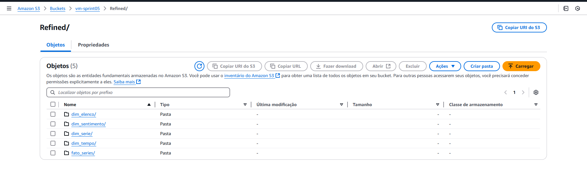

## Estrutura de Pastas
A pasta **Sprint 7** está organizada da seguinte forma:

```
Sprint 7/
├─ Certificados/  # Certificados conquistados durante a sprint, Não obtivemos certificados da AWS nessa sprint
├─ Desafio/       # Implementações relacionadas ao desafio da sprint
├─ Evidencias/    # Imagens que comprovam a execução das atividades do desafio
├─ Exercicios/    # Scripts e resoluções dos exercícios
└─ README.md      # Documentação da Sprint 7
```

---

## Certificados

Os certificados obtidos durante a Sprint 7 estão disponíveis na pasta [Certificados](Certificados/).

---
### Desafio

A pasta **Desafio** contém todos os artefatos relacionados ao desafio desta sprint. A estrutura está organizada para facilitar o entendimento das entregas e inclui os seguintes itens:

- **glue-refined.py/**: Realiza o job e processamento da camada trusted para refined
- **Arquivo README.md**: Documentação detalhada sobre o desafio, incluindo as etapas e os resultados obtidos.

---

## Evidências

As evidências para validação das execuções realizadas estão armazenadas na pasta [Evidencias](Evidencias/). Esta pasta contém capturas de tela e outros registros que comprovam a execução das atividades da sprint.

Exemplo de evidência gerada:



---

## [Exercicios](Exercicios/)

Não teve exercicios nessa sprint.
