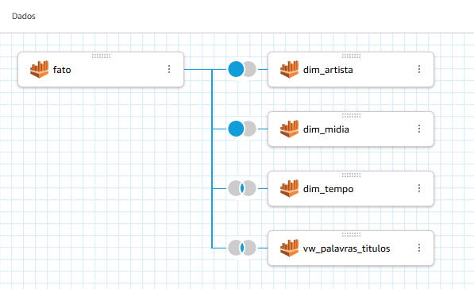

# Análise Dimensional e Visualização de Dados: Horror & Mistério

Este projeto apresenta o desenvolvimento completo de um modelo dimensional e dashboard analítico com foco em filmes e séries da temática *Horror & Mistério*. A análise foi conduzida utilizando dados da base TMDB, modelados em uma arquitetura refinada com AWS Glue, armazenados em Parquet e consumidos no Amazon QuickSight.

---

##  Refinamento e Gênero Escolhido

O gênero definido foi **Horror & Mistério**, com foco em obras que compartilham aspectos emocionais intensos, como medo, tensão psicológica e suspense. Dentro desse gênero, foi realizada uma análise detalhada da série **Bates Motel**, utilizando uma dimensão isolada para validação e estudo de métricas específicas.

---

##  Estrutura do Projeto

- Glue Jobs com processamento em PySpark
- Dados do TMDB em JSON particionados por data
- Extração e transformação com criação de tabelas dimensionais e fato
- Criação de views auxiliares para análise de sentimentos e pontuação ajustada
- Dashboard visual desenvolvido no QuickSight
- Validações feitas via Athena

---

##  Modelagem Dimensional

A modelagem segue o padrão clássico de estrela, com as seguintes tabelas:



### Tabela Fato (`fato`)
Contém os dados principais de cada título:
- `midia_key`, `tempo_key`, `artista_key`
- `tituloprincipal`, `notamedia`, `numerovotos`
- `genero`, `anolancamento`, `tempominutos`

### Tabelas Dimensionais:
- **`dim_tempo`**
- **`dim_midia`**
- **`dim_artista`**

### Tabela Especial: `dim_bates_motel`
Dimensão não ligada à fato, pois representa um caso isolado de estudo aprofundado. Foi construída a partir da API TMDB com campos adicionais:

- `sentiment_score`: Análise de sentimento textual da descrição (overview).
- A ausência de relacionamento com a fato foi intencional: esta dimensão representa um estudo qualitativo com foco narrativo.

---

##  Gráficos e Storytelling

A narrativa construída no dashboard é baseada em **7 elementos visuais distintos**, que respondem perguntas específicas. Abaixo, os detalhes de cada visualização com sua pergunta associada:

### 1. **Top 10 Títulos Mais Votados**
**Pergunta:** Quais os títulos mais influentes em Horror & Mistério?
**Resposta:** *Stranger Things* e *The Walking Dead* lideram em número de votos, demonstrando sua relevância na temática.


### 2. **Nuvem de Palavras**
**Pergunta:** Quais elementos são comuns nos títulos desse gênero?
**Resposta:** Palavras como “dead”, “night”, “blood” revelam a frequência de temas sombrios e violentos.

> **View utilizada:**
```sql
CREATE OR REPLACE VIEW vw_top_palavras_titulo AS
SELECT word, COUNT(*) AS qtd
FROM (
  SELECT SPLIT(tituloprincipal, ' ') AS palavras
  FROM fato
  WHERE genero IN ('Horror', 'Mistério')
)
CROSS JOIN UNNEST(palavras) AS t(word)
WHERE LENGTH(word) > 3
GROUP BY word
ORDER BY qtd DESC
LIMIT 50;
```


### 3. **Evolução Histórica dos Lançamentos**
**Pergunta:** Como a produção de títulos evoluiu ao longo das décadas?
**Resposta:** A produção explodiu nos anos 2000, indicando maior investimento e interesse por essas temáticas.


### 4. **Profissões na Temática**
**Pergunta:** Quem são os profissionais mais envolvidos nesse gênero?
**Resposta:** Atores (56%) e atrizes (40%) dominam a presença, com participação menor de diretores e escritores.

> **View utilizada:**
```sql
CREATE OR REPLACE VIEW vw_artistas_profissoes_simpl AS
SELECT profissao_simplificada, COUNT(*) AS qtd_artistas
FROM dim_artista
WHERE porcentagem_horror > 0.5
GROUP BY profissao_simplificada;
```


### 5. **Comparativo de Qualidade (Bates Motel vs Média Geral)**
**Pergunta:** A série Bates Motel se destaca em qualidade?
**Resposta:** Sim. Com um *quality adjusted score* de 7.26, supera a média do gênero (5.8).


> **View utilizada:**
```sql
CREATE OR REPLACE VIEW view_quality_bates_motel AS
SELECT * FROM (
  SELECT
    'Bates Motel' AS categoria,
    nota_media,
    nota_media * 0.9 AS quality_adjusted_score
  FROM dim_bates_motel
  UNION ALL
  SELECT
    'Média Geral' AS categoria,
    AVG(notamedia) AS nota_media,
    AVG(notamedia) AS quality_adjusted_score
  FROM fato
  WHERE genero IN ('Horror', 'Mistério')
);
```

### 6. **Análise de Sentimento da Descrição de Bates Motel**
**Pergunta:** O sentimento textual da série condiz com a temática?
**Resposta:** Sim. O `sentiment_score` de **-0.1** é negativo, como esperado para uma obra de horror psicológico.

> Configurado com termômetro visual e linhas de referência no QuickSight.

---

##  O que aprendi

Durante este desafio:

- Aprimorei o uso do **Amazon QuickSight** como ferramenta de visualização, aprendendo a trabalhar com temas, cores, e visualizações narrativas.
- Compreendi como o **storytelling orienta decisões visuais**, guiando a interpretação com perguntas e respostas claras.
- A construção de **views SQL validadas via Athena** permitiu extrair métricas confiáveis para o dashboard.
- Refleti sobre **modelagem dimensional**, entendendo quando uma dimensão não precisa ser integrada à fato (caso de estudos isolados).

---

##  O que minha história conta?

Essa análise revela que:
- As obras de horror e mistério mais influentes compartilham uma narrativa comum: violência, escuridão e morte.
- Bates Motel, mesmo com um sentimento negativo, tem alta qualidade e boa avaliação.
- A evolução e complexidade das produções aumentou nas últimas décadas.
- Atores e atrizes são os protagonistas do gênero, tanto nas telas quanto nos dados.

---

##  Tecnologias Utilizadas

- **Amazon S3**
- **AWS Glue / PySpark**
- **Amazon Athena**
- **Amazon QuickSight**

---

##  Área de Interesse

**Engenharia de Dados**

---
